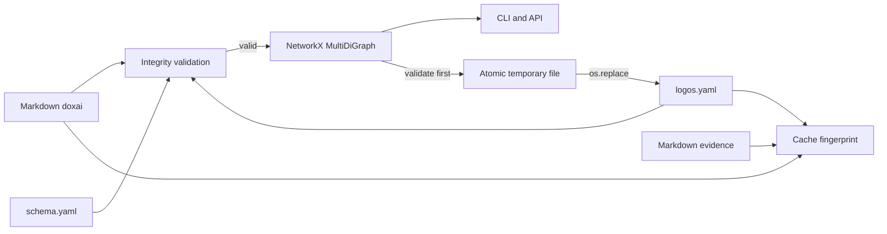

# Graph integrity

**Markdown doxai and `library/logos.yaml` remain authoritative; runtime and write paths must preserve every valid typed edge and reject state they cannot persist losslessly.**



## Invariants

| Area | Invariant |
|---|---|
| Edge identity | `(source, target, type)` is unique. Different types may intentionally share an ordered pair. |
| Runtime | `MultiDiGraph` uses canonical type as deterministic edge key. |
| Metadata | Type, alias, rationale, provenance, confidence, annotation, strength, disputed state, reviewer notes, creation date, and additional edge metadata survive load/model/save. |
| Endpoints | Logos endpoints are existing `d-*` doxai. `NEW:*`, `STALE:*`, evidence IDs, and missing slugs are rejected. |
| Types | Every type is registered in `schema.yaml`. Free-text nuance belongs in alias and rationale. |
| Writes | Full candidate edge set validates before a same-directory temporary file is atomically replaced. Parse or validation failure never becomes an empty logos. |
| Paths | `dox path` reports directed traversal by default; undirected traversal requires `--direction undirected`. |
| Trees | Canonical edge type is always visible, even when an alias exists. |
| Cache | Doxai, evidence, diegeses, and logos all contribute to the source fingerprint. |

## Validation

`dox validate` reports stable condition codes for malformed edges, dangling/placeholders/evidence endpoints, noncanonical types, self-loops, exact duplicates, intentional parallel pairs, missing beliefs, malformed tags, and unregistered domains. Intentional distinct typed pairs are warnings and remain valid; exact duplicate `(source, target, type)` rows are errors.

```bash
uv run python scripts/dox.py validate
uv run --extra dev pytest -q tests/test_graph_integrity.py
```

Validation reports belief and domain issues without inventing content or silently expanding controlled vocabularies.
