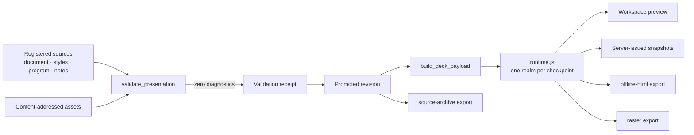
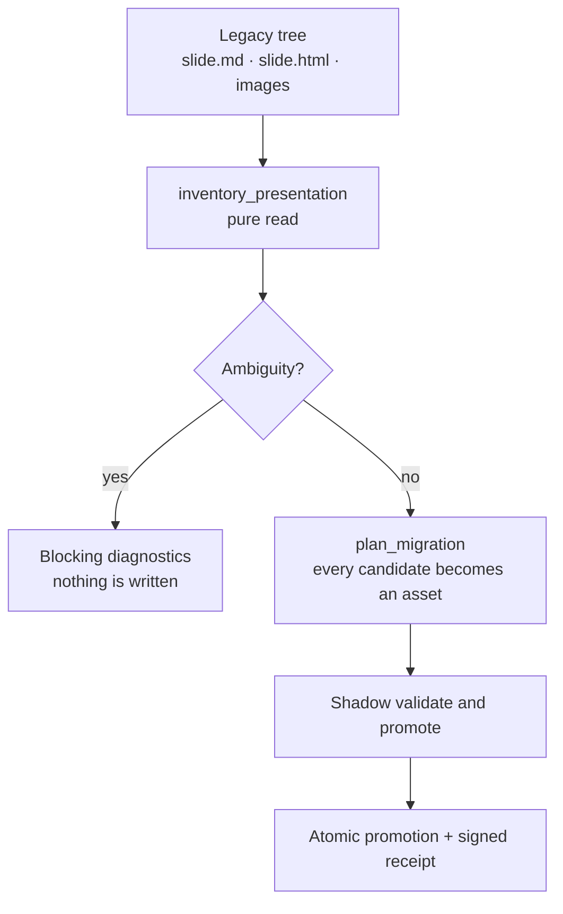

# HTML-first presentations — hosted runtime, workspace, exports, migration

**Bottom line:** a presentation revision is an ordered, labeled set of registered
atomic checkpoints. One runtime
([`runtime.js`](../src/doxagon/presentations/resources/runtime.js)) executes every
checkpoint in its own opaque-origin realm, reached only by absolute seek. There
is no slide cursor, no `layout` mode, no selected or primary image, and no second
runtime. This document is the operator's map of what exists today and what is
deliberately deferred.

## Authority

| Question | Answer | Producer |
|---|---|---|
| What orders a deck? | `checkpoint_order` only | [`contracts.py`](../src/doxagon/presentations/contracts.py) |
| What names a position inside one revision? | `DeckCursor` — `{deckRevision, sequence, checkpointId}`, with no session and no epoch | [`cursor.py`](../src/doxagon/presentations/cursor.py) |
| What names a position in a live session? | `Snapshot` — `{session_id, deck_revision, epoch, sequence, checkpoint_id, issued_at}`; its `.cursor` projection is the `DeckCursor` above | [`session.py`](../src/doxagon/presentations/session.py) |
| What is a slide/section? | Optional grouping and export boundary | [`contracts.py`](../src/doxagon/presentations/contracts.py) |
| Who issues a live cursor? | The server, never a client — clients may believe only a `Snapshot` | [`session.py`](../src/doxagon/presentations/session.py) |
| What identifies a revision? | A calculated digest over sources, registrations, edges, assets, and the runtime's own bytes | [`receipt.py`](../src/doxagon/presentations/receipt.py) |

A v2 manifest **rejects** `layout`, `selected`, `is_primary`, `slide_index`,
`step`, `thumbnail`, and the rest of the legacy vocabulary by name; silently
dropping them is how a slide-first cursor would survive a migration.

## Product cutover — `/presentations` is the editor and the viewer

The Step engine used to sit behind a separate `/decks` workbench over one global
workspace root, while the real vault route still ran the legacy slide/image
editor. That is over. `/presentations` is now the only editor and the only
viewer, and it is vault-native.

| Concern | Where it lives now |
|---|---|
| Workspace API | `install_vault_presentations` mounts the workspace router at `/api/presentations/{presentation_slug}` ([`api.py`](../src/doxagon/presentations/api.py), [`main.py`](../apps/web/backend/main.py)). |
| Which store a request edits | [`vault.py`](../src/doxagon/presentations/vault.py) `open_or_migrate` resolves the selected presentation, refuses a traversing or dotted slug, and migrates the legacy tree once behind a verifiable receipt. |
| Editor and viewer | [`PresentationWorkspace.svelte`](../apps/web/frontend/src/lib/components/PresentationWorkspace.svelte) under [`/presentations`](../apps/web/frontend/src/routes/presentations/+page.svelte). |
| Canvas, audience, presenter | One `CheckpointPreview` over `runtime.js`, three clients of one server session: the editor canvas acts, [`StepAudience.svelte`](../apps/web/frontend/src/lib/components/presentation/StepAudience.svelte) follows, and [`/present/{slug}?session=`](../apps/web/frontend/src/routes/present/%5Bthesis%5D/+page.svelte) drives. |
| `/decks` | A redirect into `/presentations`. It keeps no state and mounts no runtime. |

There is no `PRESENTATION_WORKSPACE_DIR` behind the product any more. A vault
presentation is opened at `<presentation>/.doxagon-presentation-v2/store`, which
is exactly where `migration.promote` publishes it, so the store the editor writes
and the receipt that vouches for it are the same artifact.

### What was removed from the client

`setPrimaryImage`, `findDisplayImage` (the `images[0]` fallback), the legacy
slide stores, the `layout`/`animation` branching, the browser-originated
slide-change and step broadcast, and the whole legacy slide editor component
tree are deleted, not hidden. The remaining legacy surface is
`LegacyReadAdapter` ([`migration.py`](../src/doxagon/presentations/migration.py)),
which answers inventory reads for unmigrated trees and refuses every write.

### Viewport ownership

The app shell alone declares a viewport height (`100svh` in
[`+layout.svelte`](../apps/web/frontend/src/routes/+layout.svelte)). The
workspace, the presenter console, and the audience overlay use `height: 100%`,
`min-height: 0`, and scoped overflow. The Step canvas holds a `16 / 9` aspect
ratio inside the space it is given; the previous width-derived `60vw` height
made a narrow screen paint a stage taller than the screen.

## The one runtime

`src/doxagon/presentations/resources/runtime.js` is the only runtime. The
frontend serves the same bytes through a symlink
(`apps/web/frontend/static/presentation-runtime.js`), and
[`runtime.py`](../src/doxagon/presentations/runtime.py) is the only reader that
inlines them into an export. A test fails if a second file declares the runtime
version.

Those bytes are part of revision identity, not just a version string. The
revision input, the compose hash, and the receipt all pin
`{version, sha256}` (`RUNTIME_PIN` in
[`receipt.py`](../src/doxagon/presentations/receipt.py)), so editing the runtime
changes every revision it could produce. A revision validated under other bytes
is refused at load with `PRES_RUNTIME_BYTES_MISMATCH` (409) rather than
presented or exported under today's runtime, and `verify_receipt` reports the
stored receipt as stale until the deck is revalidated. Old revisions therefore
cannot silently acquire new runtime behaviour.

### Realm and capabilities

Each checkpoint runs in an `iframe` with `sandbox="allow-scripts"` and **no**
`allow-same-origin`, so it has an opaque origin and cannot reach host DOM,
cookies, storage, or another checkpoint. Inside the realm:

- the realm document carries **two** module scripts: the broker program first,
  then the author entry. They are separate module scopes, so the raw host APIs,
  the open-handle registry, and the host channel are unreachable from author
  code by name; the entry hands its `create` to the broker through the single
  `__doxagonRegisterCheckpoint` registrar, which is withdrawn once the
  document's scripts have run;
- host traffic runs over a `MessageChannel` port the broker offers before any
  author byte executes. Author code holds no port, cannot read a host request,
  and cannot answer one — the host adopts only the first port a realm offers,
  so a forged `ready` from a checkpoint claims nothing;
- every host API for an ungranted capability is replaced by a throwing stub
  before author code exists (`PRES_CAPABILITY_DENIED`) — the broker module runs
  to completion before the author module is evaluated, so withdrawal precedes
  even author top-level code;
- granted capabilities arrive only through brokered handles that the runtime can
  enumerate and force-close;
- assets arrive as handles exposing approved bytes — never a path or storage key;
- the realm's CSP denies `connect-src` entirely.

The realm program is loaded from a `data:` URL rather than inlined. A
local-scheme child inherits its parent's CSP, so an inline realm script would be
refused by the host document's hash-pinned `script-src`; the `data:` form lets
the host keep that hash *and* run the revision's own registered bytes.

### Absolute seek, edges, closure

`seek(checkpointId)` aborts the active instance, calls `exit()`, verifies every
brokered handle closed, destroys the realm, then builds a **new** realm from the
registered bytes and calls `create()` and `enter()`. Nothing is replayed,
decremented, or mutated in place.

- Seeking one checkpoint twice must produce the same `signature()`; otherwise
  `PRES_CHECKPOINT_NONDETERMINISTIC`.
- A handle left open at `exit()` fails the transition with
  `PRES_CHECKPOINT_LEAK` instead of continuing with shared mutable state.
- `NEXT`/`PREVIOUS` traverse the halves of a registered edge. A checkpoint with
  no registered forward edge simply has no Next.
- `prefers-reduced-motion` is honoured by the shell and passed into the realm as
  `context.reducedMotion`.

### Sessions

`SessionService` persists `{session_id, deck_revision, epoch, sequence,
checkpoint_id}` and issues every snapshot itself. A client rejects a foreign
revision or session, a stale `(epoch, sequence)`, or an equal pair naming a
different checkpoint. Moving a live session to another revision bumps the epoch,
which ends the previous line rather than seeking inside a deck a viewer no longer
holds.

The workspace preview consumes that service rather than advancing itself:
[`CheckpointPreview.svelte`](../apps/web/frontend/src/lib/components/deck/CheckpointPreview.svelte)
opens a session, sends every control action to
`POST /api/presentation/sessions/{id}/actions`, checks the answer with
`acceptsSnapshot` (the client mirror of `Snapshot.accepts`), and only then seeks
the runtime to the checkpoint the server named. A preview that cannot reach the
service reports the degraded cursor instead of presenting a locally invented one.

## Hosting

`install_presentation_workspace` mounts the router, the `WorkspaceError`
contract, and the raster capturer. The deployed app
([`main.py`](../apps/web/backend/main.py)) and the isolated one-workspace app
share exactly that wiring, so the routes a test exercises are the routes the
deployment serves. The workspace root is `DOXAGON_PRESENTATION_WORKSPACE`
(default `<root>/presentations/workspace`); an unprovisioned root answers
`PRES_WORKSPACE_NOT_FOUND` rather than being created on demand.

### The aggregate declared-asset budget

**One deployment variable, bounded on both sides, refused when unreadable.**
Every other validation limit is schema. This one is not, because its right value
depends on the corpus: a migrated vault deck declares *every* image candidate
ever produced for it — the migrator preserves unreferenced variants on purpose —
so the aggregate declared total scales with authorship history, not with deck
complexity.

| | |
|---|---|
| Variable | `DOXAGON_PRESENTATION_MAX_TOTAL_ASSET_BYTES` |
| Units | whole decimal bytes (no suffix, sign, exponent, separator, or fraction) |
| Default when unset | `536870912` (512 MiB) |
| Hard ceiling | `68719476736` (64 GiB) = `MAX_ASSETS` × `MAX_ASSET_BYTES` |
| Refusal | `PRES_ASSET_POLICY_INVALID`, HTTP 500, raised where the value is read |
| Deck over budget | `PRES_VALIDATION_FAILED` (422) whose every diagnostic is `PRES_ASSET_LIMIT`, located at the `/assets/<index>` record that crossed it |

The ceiling is derived, not chosen: `MAX_ASSETS` records of `MAX_ASSET_BYTES`
each is the largest revision this schema can describe
([`contracts.py`](../src/doxagon/presentations/contracts.py)), so a number above
it is not a bigger limit — it is a request for no limit, and it is refused as
one. Set the smallest value that admits the host's own vault: this budget is the
only bound on total revision size below that structural maximum. Peak validation
memory does not follow it, because assets are read, verified, and released one
at a time under the unchanged 64 MiB per-asset maximum
([`sources.py`](../src/doxagon/presentations/sources.py) `read_asset`).

A misconfigured value refuses at import of
[`main.py`](../apps/web/backend/main.py), so the process cannot start and then
validate decks against a limit nobody chose. Empty, `0`, negative, `512MiB`,
`1e9`, `1_073_741_824`, and anything above the ceiling all refuse; only an unset
variable selects the default.

The budget is carried by one `ValidationPolicy` object from
`install_vault_presentations` through the vault open, the first migration
(shadow store and published store alike), every later mutation, receipt
verification, and every export, so a deck that migrates cannot fail on its next
edit or build. Raising it relaxes nothing else: per-asset size, asset count,
no-follow containment, regular-file and exact-size checks, digest, media
signature, provenance, and atomic promotion are unchanged.

## Product language and internal contracts

**The visible workspace and the stored contract use different words on purpose.**
A product term is what an author reads; a contract term is what the schema, the
HTTP surface, the storage keys, the protocol symbols, and the error codes are
named. Renaming one never renames the other.

| Product term (visible) | Contract term (schema, API, storage, codes) |
|---|---|
| Step | `checkpoint`, `checkpoint_id`, `checkpoint_order`, `/checkpoints/{id}` |
| Transition | `edge`, `edges`, `edge_id`, `transition`, `PRES_EDGE_ABSENT` |
| Permission | `capability`, `capabilities`, `PRES_CAPABILITY_DENIED` |
| Media | `asset`, `assets`, `asset_id`, `storage_key`, `/assets/{id}` |
| Edit with AI | `agent`, `agent-tasks`, `AgentPatch`, `PRES_AGENT_TASK_STALE` |
| Section | `group`, `groups`, `/groups/{id}`, `PRES_GROUP_NOT_AUTHORITY` |

Three consequences, each of them deliberate:

- **Grant names are protocol symbols, not copy.** The Permissions panel lists
  `media`, `timers`, and `worker` verbatim, because the broker honours exactly
  those strings; a prettier label would name a grant nothing implements.
- **A refusal is reported code-first.** The workspace shows a product-language
  lead-in and then the server's own diagnostic verbatim, marked as developer
  detail, so an operator can match what they read to the contract that raised
  it.
- **The stable identifier lives behind a disclosure.** *Technical details* in
  the Source panel is the one product surface that says **Checkpoint ID**, and
  it says it beside the registered path and digest it belongs to. Everywhere
  else the value appears without a contract label. The stored section id a
  migrated deck carries (`group-<slug>`, which `/groups/{id}` addresses) is
  shown verbatim beside its label and marked `data-advanced` for the same
  reason a refusal code is: it is the producer's own minted value, not copy.

Browser proof:
[`presentation-workspace.spec.ts`](../apps/web/frontend/tests/presentation-workspace.spec.ts)
— *no rendered panel names an internal contract outside a developer disclosure*
— walks the visible text of all seven inspector tabs over the real migrated
vault, skips subtrees marked `data-advanced`, and fails if `checkpoint`,
`edge`, `capability`, `asset`, `agent`, or `group` reaches a rendered product
surface. The same test then asserts what those two skipped regions actually
hold, so the exclusion stays a declared developer surface rather than a way to
pass the scan.

## Workspace

`/presentations` is Step-first: an ordered outline (index, label, stable id, section
badges, status, media and permission counts), an absolute-seek preview showing
the live signature and the server-issued cursor, and an inspector over Source,
Transitions, Permissions, Sections, Media, and the scoped *Edit with AI* flow.

- **Transitions** are edited by opting a step into (or out of) the generated
  linear transition. The server refuses a one-sided transition or one its
  registration does not declare, so a half edit is rejected rather than landed.
- **Permission grants** are edited per step over the closed broker vocabulary.
  The manifest grant is the authority and the registration is the request, so
  revoking one a program still requests is refused with
  `PRES_CAPABILITY_UNGRANTED`.
- **Sections** can be created, relabeled, joined, left, and deleted. A section
  body carries no order, cursor, or default; `put_group` refuses any other
  member as `PRES_GROUP_NOT_AUTHORITY`.

- Every mutation sends `If-Match: "<revision>"`; a refusal reports its code and
  leaves the promoted revision untouched.
- Raw `document.html`, `styles.css`, `program.js`, and `notes.md` are editable as
  text. There is no template DSL, property palette, or reveal/hide list.
- The media grid shows every variant as its own labeled record with provenance,
  job status, retry, delete, and an explicit *use in this step* toggle.
  No variant is primary or selected, and there is no Display Image action.
- An AI edit is scoped to one step; the patch is promoted only after a human
  approves it, and only against the revision the request was issued for.
- The presentation toolbar builds all three artifacts: *Build offline HTML* and
  *Export sources* are direct links to their `GET` routes, and *Build images*
  posts to `/exports/raster`, waits for the capture the server's browser
  runtime performed, and reports the revision the archive was sealed at — or
  the refusal, when a deployment configured no runtime.
- Generation history lists every attempt chronologically. `JobStore.list`
  orders a collision on `created_at` by lineage and attempt, so a retry always
  follows the attempt it replaces even though `now()` is second-resolution.

## Exports

| Command | Artifact | Fails closed on |
|---|---|---|
| `export_offline_html` | one self-contained `presentation.html` | unresolved asset, unsupported capability, module graph, stale receipt |
| `export_raster` | one PNG per checkpoint (`--groups` partitions) plus `export-manifest.json` | missing frame, missing signature, unknown group |
| `export_source_archive` | deterministic ZIP of manifest, sources, assets, receipt | stale receipt |
| video | — | `PRES_EXPORT_FORMAT_DEFERRED` |

The offline document declares no network source at all: `default-src 'none'`,
`connect-src 'none'`, no absolute URL anywhere in the file, and a `script-src`
hash over the shell. A browser test loads the committed export and asserts zero
requests.

The raster ZIP carries its own proof as `export-manifest.json`: the revision,
the verified receipt digest, the compose hash, the asset closure digest, the
deck digest, the runtime version **and byte digest**, the export policy, the
requested groups, and each capture's reported signature, byte count, and digest.
The hosted route returns artifact bytes, so a manifest kept only in the caller's
`ExportResult` would never reach the consumer holding the ZIP.

### Deliberately deferred, and why

| Deferred | Reason | Signal |
|---|---|---|
| Video export | No moving-image artifact is produced; emitting a still would be a false artifact | `PRES_EXPORT_FORMAT_DEFERRED` (501) |
| Multi-module checkpoints at runtime | A module graph needs a resolvable specifier space the realm does not have; guessing a resolution would run unpinned bytes | `PRES_RUNTIME_MODULE_GRAPH_UNSUPPORTED` |
| `network`, `storage`, `worker` in a closed export | A closed document cannot honour them; shipping one that misbehaves offline is worse than refusing | `PRES_EXPORT_CAPABILITY_UNSUPPORTED` |

## Migration

- **Inventory writes nothing.** The legacy list path derives thumbnails while
  reading; this one does not, and no `mtime` or thumbnail ever becomes an
  authoring decision.
- **Every candidate is minted**, selected or not, with its legacy path, bundle,
  filename, and digest recorded as provenance. Unselected candidates survive as
  records referenced by no checkpoint.
- **Ambiguity blocks**: a bundle with candidates and no selection, a selection
  naming no candidate, `layout: html` with no `slide.html`, unknown script or
  embedded contexts, a duplicate identifier, or an unreadable source. The sole
  script exception is the source-defined stock choreography template: after
  extracting only its `STEPS` integer and JSON `MOTION` map, every remaining
  byte must match. Migration expands its steps into atomic checkpoints backed
  by one registered, capability-free module.
- **Shadow before promote**: the whole candidate deck is validated and promoted
  into a throwaway store first, so a deck that cannot validate never touches the
  target root.
- **Receipts are signed and idempotent**: a domain-separated digest over the
  receipt body; re-running against an unchanged tree returns the same receipt.
- **The compatibility window is read-only, and the running app enforces it.**
  Once `is_migrated` finds a verifiable receipt, the legacy router refuses every
  mutation for that deck — slide creation, order, image selection, primary
  image, HTML, layout, text, generation, and build — through the same
  `LegacyReadAdapter` refusal (`PRES_LEGACY_READ_ONLY`, 405). Legacy reads keep
  answering. A bare marker directory is not proof: authority is only considered
  moved when the promotion receipt verifies.
- **Order is read, never inferred.** The narrow legacy declaration is an
  ordered string array in `outputs/presentation/config.yaml`, for example
  `slide_order: [opening, market]`. When no `config.yaml` declares
  `slide_order`, inventory still reports every slide and candidate but records
  the order as `unresolved` and raises `PRES_MIGRATION_ORDER_UNDECLARED`, which
  blocks promotion until an operator declares the sequence.
- **Identity is the legacy address, not the bytes.** Two byte-identical
  candidates stay two records with two filenames, bundles, and source refs; the
  shared blob is stored once under a content-addressed `storage_key`.
- **`retirement_census`** counts migrated, unmigrated, and blocked decks under a
  given directory. It reads only public presentation trees; it never opens
  private-vault content.

## What proves what

| Property | Proof |
|---|---|
| Payload carries only registered bytes; session cursor is server-issued | `tests/test_presentations_runtime.py` |
| The deployed app mounts the workspace, sessions, error contract, and capturer | `tests/test_presentations_hosted_app.py` |
| Closed exports, deterministic archives, fail-closed capabilities | `tests/test_presentations_export.py` |
| Real browser raster capture: readiness, signatures, ordering, group boundary | `tests/test_presentations_export.py` |
| Read-only inventory, blocking ambiguity, signed idempotent promotion | `tests/test_presentations_migration.py` |
| Identical bytes keep distinct provenance; undeclared order blocks | `tests/test_presentations_migration.py` |
| A migrated deck refuses every legacy write and still answers reads | `tests/test_presentations_legacy_boundary.py` |
| Opaque realms, runtime denial, seek determinism, reverse edges, closure, zero network | `apps/web/frontend/tests/presentation-runtime.spec.ts` |
| Producer-backed generation and AI authoring; only a failed job is retryable | `tests/test_presentations_authoring.py` |
| Vault-native editor: migration, Step/Section/media/source/AI mutation, shared playback, export, viewport ownership | `apps/web/frontend/tests/presentation-workspace.spec.ts` |
| The toolbar builds images through the hosted capturer, and the archive carries real frames, signatures, and manifest | `apps/web/frontend/tests/presentation-workspace.spec.ts` |
| No inspector tab names an internal contract outside a declared developer surface | `apps/web/frontend/tests/presentation-workspace.spec.ts` |
| A retry submitted in the same second as the attempt it replaces still lists after it | `tests/test_presentations_workspace.py` |
| The aggregate asset budget is bounded, refuses unreadable values, and forces both sides of `PRES_ASSET_LIMIT` | `tests/test_presentations_asset_policy.py` |
| One budget governs migration, later edits, receipt verification, and export of the same deck | `tests/test_presentations_asset_policy.py` |
| The hosted app admits a vault-sized candidate set under its configured budget and refuses over it | `tests/test_presentations_hosted_app.py` |

## The two configured backends

`doxagon.presentations` holds no execution facility, so the two seams it
declares are implemented in `src/doxagon/presentation_backends.py` and named by
deployment:

| Environment variable | Seam | Interface |
|---|---|---|
| `DOXAGON_IMAGE_GENERATOR` | `generation.ImageGenerator` | argv from `generator_argv` (`--prompt-file`, `--output`, `--image-size`, `--aspect-ratio`, repeated `--source`); writes image files into the output directory |
| `DOXAGON_AGENT_AUTHOR` | `authoring.AgentAuthor` | the authoring request (the server-issued task included) as JSON on stdin; the proposed source on stdout |

(`DOXAGON_PRESENTATION_MAX_TOTAL_ASSET_BYTES` is deployment configuration, not a
backend: it names a limit, not an executable. See *The aggregate declared-asset
budget* above.)

Neither has a fallback. With none configured the routes answer
`PRES_GENERATOR_UNAVAILABLE` and `PRES_AGENT_AUTHOR_UNAVAILABLE`, because a
placeholder image would enter the store as a generated asset and a synthesized
"proposal" would be the editor approving its own text.

Committed screenshots live in
`docs/images/presentation-workspace/`.

Every fixture in these suites is synthetic and public. No test reads a vault, a
thesis directory, or any configured content root.
