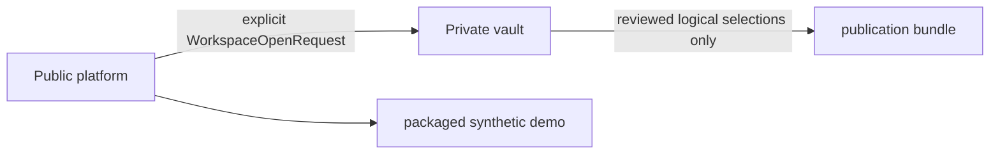

# Private vault boundary threat model

## Boundary

The platform must not discover a vault from its checkout or current directory. `src/doxagon/workspace.py` resolves only explicit request/configuration inputs; demo mode verifies only the packaged synthetic fixture before opening it. Stage I tests create temporary synthetic vaults and do not open `library/` or `theses/` bodies.

## Threats and controls

| Threat | Control | Evidence |
|---|---|---|
| Checkout/cwd accidentally selects private data | Converted-module architecture guard rejects cwd/checkout discovery and legacy-global imports. | `tests/test_architecture_guard.py` |
| Extension file substitution or reordering | Fixed manifest path, ordered entries, normalized paths, and raw-byte SHA-256 checks. | `tests/test_workspace.py` |
| Unreviewed publication action | Closed v1 JSON schemas reject unknown major versions and actions before a vault is read. | `tests/test_publication_contracts.py` |
| Demo fixture drifts or gains non-synthetic content | Provenance statement plus exact bidirectional file/hash inventory. | `tests/test_workspace.py` |

The legacy adapter is explicitly outside converted modules. It is the only eventual location permitted to import legacy path globals; converted modules may not import it or `doxagon.config`.
