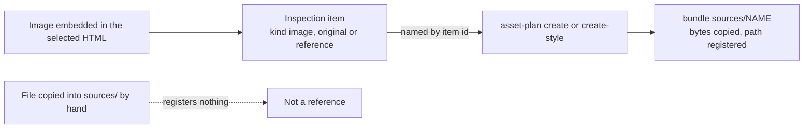
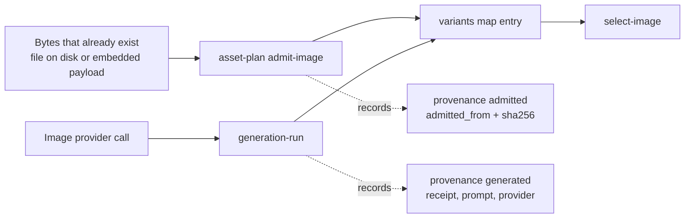

# Authored document operations

The `dox document` facade reads the explicit vault/project. Install the platform with `uv sync --extra dev`; its `.venv/bin/dox` works from a vault or nested project cwd. Browser validation also needs Chromium (`uv run playwright install chromium` in the platform). `DOXAGON_ROOT` explicitly selects a vault; invalid roots are refused.

## Context and source

```bash
dox document context --project observatory --json
dox document inspect --project observatory --item ITEM --snapshot SNAPSHOT
```

Use the returned snapshot and opaque item IDs below. Root context without a project lists projects. Default context excludes image bytes and note bodies; explicit inspection of the notes item returns paged private text.

Inspecting an image item also returns `generation`: its linked source origins,
image-specific prompt item, inherited components/tags, saved prompt records and
current assembly item. Inspect those returned item IDs with the same snapshot
to read their paged text. Default context contains no prompt bodies. A saved
prompt is verified only against a matching generation receipt; an unverified
bundle association or a current assembly is not a claim about historical inputs.

The Media gallery's **Image details and generation** and in-app image viewer
show the same information. See [Image generation details](./image-generation-details.md).

## Text, captions and coherent cue changes

Write `change.json`:

```json
{"patches":[{"item":"DOCUMENT_ITEM","before":"Old caption","after":"New caption"}]}
```

Each `before` must occur exactly once. To change cue identities/order, include the corresponding HTML, edition and notes patches together.

The cue list that must agree with the notes is the one the **runtime** reports over the bridge, not the `data-cue` attributes in the source. A document whose bridge builds its cue list by querying the DOM collects only the elements that exist when its `<script>` runs, so a `<section data-cue="...">` inserted after that script is never reported. Source order then matches the notes exactly while the runtime list is short.

`DOCUMENT_NOTES_MISMATCH` names the specific disagreement rather than only the code: differing `documentId` or `edition` values with both sides quoted, which cue ids are missing from which side, or the cue whose notes body is not a string. When a cue the notes declare was not reported and its element sits after the bridge script, the message names that placement as the cause.

```bash
dox document plan --project observatory --snapshot SNAPSHOT --change change.json --output change-plan.json
dox document apply --project observatory change-plan.json
dox document validate --project observatory --record
```

Plans carry complete postimages and expected input hashes. Their stdout summary omits encoded postimages. Store plan files outside registered source directories, review their paths and hashes, then apply. Output plan files must be new. Browser checks run before acquiring the vault writer fence. Multi-file promotion uses the vault WAL; explicit `dox document recover --project observatory` rolls an interrupted transaction forward. Unprovable recovery refuses further writes; Git is the separate operator rollback mechanism.

`validate` alone is read-only. `--record` explicitly stores a successful proof with dependency hashes in private authoring metadata. Changed dependencies, validation implementation or built player make it stale.

## Canonical assets and styles

`asset-plan` accepts a JSON request. Examples:

```json
{"operation":"create","key":"night-sky","dialect":"legacy-bundle/1","definition":"---\nstyles: []\nconfig:\n  resolution: 2k\n  aspect_ratio: '16:9'\n---\nA telescope beneath a clear night sky.","references":{}}
```

```json
{"operation":"create-style","key":"ink","dialect":"stored-style/1","definition":"Fine ink drawing.","references":{"reference.png":"IMAGE_ITEM"}}
```

`IMAGE_ITEM` is an item id from `dox document context --json`, not a filesystem path.

```json
{"operation":"adopt","key":"opening-plate","source":"outputs/presentation/slides/01-opening/images/main"}
```

```bash
dox document asset-plan --project observatory --snapshot SNAPSHOT --request asset-request.json --output asset-plan.json
dox document apply --project observatory asset-plan.json
```

New assets/styles use canonical `assets/` bundles. References copy bytes from named inspection items. Adoption includes ignored files, references, original variants, exact prompts/provenance and the used style closure. It retains old bytes and records path/hash mappings; repeated adoption is unchanged. Historical associations remain unknown unless supported by hashes/receipts. Check active worktree ownership before adopting a real project. Relocation alone does not edit HTML or notes.

### References are bound by item id, never from disk



Every reference is bound by **item id from the snapshot**. Each value in the request's `references` map is an inspection item id of kind `image`, `original` or `reference` (`copy_references`, ./src/doxagon/renderings/document_assets.py:100); the plan copies that item's bytes into `sources/NAME` and registers the resulting path. Generation reads the registered list, not the directory.

An image becomes a referenceable item **only by being embedded in the document**. `inspect_document` observes `data:image/...;base64,` payloads in the selected HTML (./src/doxagon/renderings/document_inspection.py:129). To use a photograph as a line-quality reference, embed it in the HTML first, read its item id from `dox document context --json`, then name that id.

A file placed in a bundle's `sources/` directory is **NOT registered**. Copying a `.jpg` into `assets/styles/ink/sources/` gives the registry nothing to resolve. A `create-style` or `create-asset` request whose definition frontmatter declares `sources:` entries that the request does not register is refused as `DOCUMENT_REFERENCE_UNREGISTERED`, naming each unregistered file — previously such a bundle was accepted with `references: []` and failed much later at `generation-plan` with `DOCUMENT_INPUT_MISSING`. Both refusals stand; the earlier one names the cause.

### Stable slots: an `id` on the image element

A slot is **stable** when the image element carries an `id` attribute — `'stable': bool(data.get('id'))` (./src/doxagon/renderings/document_inspection.py:203). `bind-slots` and `select-image` operate only on stable slots. `data-slot` on a `<figure>` is a document's own CSS convention, not a platform mechanism: a figure carrying `data-slot` whose inner `` has no `id` reports `stable: false` with a generated `observed-slot-N` name, and naming it raises `DOCUMENT_USAGE_INVALID: Unknown slot or asset`.

A minimal working example. The placeholder is any embedded raster; generation replaces its bytes, not its identity:

```html
<figure>
  
</figure>
```

```bash
# 1. Bind the stable slot to a registered asset.
dox document asset-plan --project observatory --snapshot SNAPSHOT \
  --request bind.json --output bind-plan.json      # {"operation":"bind-slots","associations":{"plate-hero":"night-sky"}}
dox document apply --project observatory bind-plan.json

# 2. Select a generated variant into that slot.
dox document asset-plan --project observatory --snapshot SNAPSHOT \
  --request select.json --output select-plan.json  # {"operation":"select-image","key":"night-sky","variant":"VARIANT_ID","slots":["plate-hero"]}
dox document apply --project observatory select-plan.json
```

`dox document context --json` lists every `usages[]` entry with its `stable` flag; check it before writing a bind request. `bind-slots` also assigns deterministic `dox-image-N` ids to image elements that lack one (`adopt_slots`, ./src/doxagon/renderings/document_images.py:149), so a document authored without ids can still be bound — review the proposed slot map in the plan.

### Admitting artwork you already have

Step 2 above assumes a variant exists. When the finished image already exists — drawn by hand, delivered by a designer, or produced outside this platform — `admit-image` registers those exact bytes as a variant of an already registered asset. Use `generation-run` when the provider is to make the image; use `admit-image` when the bytes already exist. `adopt` is a different operation for a different input: it relocates a whole legacy visual bundle under `outputs/presentation/slides/` and refuses anything else with `DOCUMENT_ADOPTION_SCOPE`.

```json
{"operation":"admit-image","key":"night-sky","source":"incoming/finished-plate.png"}
```

```json
{"operation":"admit-image","key":"night-sky","item":"IMAGE_ITEM"}
```

Name exactly one of `source` (a project-relative file) or `item` (an inspection item id of kind `image`, `original` or `reference`). The `item` form is what an image embedded in the document needs, since such bytes exist nowhere else on disk. The plan copies the bytes to `assets/visuals/KEY/variants/admitted-<hash>.EXT` and registers the variant; `apply` promotes it. The result has the same shape a generated variant has, so `select-image` accepts it with no special case.



Provenance stays honest in both directions. An admitted variant records `"provenance": "admitted"`, an `admitted_from` naming the source path or item id, and the `sha256` of the admitted bytes. It carries **no** `receipt`, prompt file, `prompt_sha256` or provider identity, because no provider call happened — the receipt chain is exactly what makes a generated image auditable, and inventing one for artwork that was never generated would make that chain worthless. Context reports the admitted variant with `provenance: admitted` and `generated_with: null`, next to any `generated`, `partial_generation` or `historical_unknown` sibling. An adopted bundle keeps a legacy `assembled_prompt.md` beside its variants; inspection reports no saved prompt for an admitted variant, because that neighbour describes a generation that produced some other image.

Admission refuses, naming the cause: `DOCUMENT_ADMISSION_IMAGE_INVALID` when the bytes are not a bounded single-frame PNG/JPEG/WebP raster, `DOCUMENT_ASSET_UNKNOWN` when the named asset is not registered (register it with `create` first), and `DOCUMENT_VARIANT_EXISTS` when the asset already holds a variant admitted from these exact bytes. Variant identity is the hash of the bytes, so re-running an admission is refused rather than duplicating an image under a second name.

## Generation: candidates first

The existing configured subprocess provider is selected by `DOXAGON_IMAGE_GENERATOR`. `DOXAGON_IMAGE_MODEL` optionally records its configured model identity; absent model reporting remains explicitly unknown. No credentials enter context or receipts. The executable receives the existing `--prompt-file`, `--output`, `--image-size`, `--aspect-ratio` and repeated `--source` interface. Context reports the configured executable identity/hash and supported settings.

```bash
dox document generation-plan --project observatory --snapshot SNAPSHOT --asset night-sky --variants 1 --output generation-plan.json
dox document generation-run --project observatory --key night-sky-request-1 generation-plan.json
```

Planning has no provider effect. Running may incur charges and requires a bounded user request. The named dialect resolves the prompt once; execution verifies those exact bytes, reference hashes and provider identity. Current settings support `1k`, `2k`, `4k`; aspect ratios are listed in context. Every dialect refuses missing inputs, unsupported settings and reference closures over the negotiated maximum without truncation. A plan's `warnings` list is printed to stderr by `generation-plan`; review it beside the prompt.

`legacy-bundle/1` retains the legacy assembler's fixed preamble, constraints, palette rule, dependency order and original reference order. `stored-style/1` retains its flat ordered prompt fragments and stable reference deduplication. Both are frozen: their output is hash-pinned in `tests/test_prompt_dialect_stability.py`. Mixing dialects is refused.

`brief/1` (specified in `docs/modernization.md`, section 5) emits a YAML header (`schema`, `intent`, `settings`, `references[]` with `index`/`file`/`from`/`role`) followed by delimited prose sections; `index` is the `--source` position the provider receives. Frontmatter adds `dialect: brief/1`, a required asset-level `intent`, and `sources:` items that are either a file name or `{file, role}`. Nothing is injected implicitly: `constraints/layout` and palettes take part only when listed in `styles:`. A missing `intent` is `DOCUMENT_DEFINITION_INVALID`, a role naming an unregistered file is `DOCUMENT_INPUT_MISSING`, a source without a role and prose over 600 words are plan warnings. `**Tag:**` and `**Requires:**` body markers carry no meaning in any dialect; `dox styles lint PROJECT` reports them, and `--fix-requires` mirrors body dependencies into frontmatter `requires:` (printing a diff) without touching body text.

Each candidate gets an immutable original, exact prompt and receipt under `assets/visuals/ASSET/variants/`. Generation does not select it into the HTML. Jobs and pending admissions use the shared durable job store under the project's private `.doxagon/document-generation/`. Pending returned bytes are retained locally until admission; do not clear that directory while a job needs recovery.

```bash
dox document generation-job --project observatory JOB
dox document generation-job --project observatory --recover JOB
dox document generation-run --project observatory --key night-sky-request-1 --retry-of JOB generation-plan.json
```

An idempotency key replays an existing result. An explicit retry preserves lineage/prompt and skips successful candidates. Interrupted jobs require explicit recovery; returned pending candidates are reused without another provider call. An unreceipted returned file requires inspection, rather than an automatic paid retry. Failure receipts preserve the request and errors; provider diagnostics are not copied into receipts where they could expose credentials.

The subprocess contract returns one candidate per planned variant. If it exits unsuccessfully or times out after writing a bounded image, that candidate is retained with `partial_generation` provenance and the provider failure in its receipt. The job remains failed, including on replay/retry; inspect and explicitly select the retained image, or authorize a new plan. Retrying does not pay again for an already retained candidate.

## Bind usages, then select

```json
{"operation":"bind-slots","associations":{"slot-0":"night-sky","slot-reused":"night-sky"}}
```

Stable IDs are independent of payload hashes. A document lacking image IDs can receive deterministic IDs through this explicit plan; inspect the proposed slot map. Binding establishes authorship association and does not invent historical provenance.

```json
{"operation":"select-image","key":"night-sky","variant":"VARIANT_ID","slots":["slot-0"],"quality":88}
```

Selection encodes once to WebP, verifies the old payload at every named slot and updates only those slots. It preserves alt text/geometry and reorders progressive payloads by first remaining usage, retaining the completion sentinel. Supported streaming envelopes use the existing figure/receive layout; arbitrary dynamic image targeting is refused. Encoding receipts record the source hash, embedded hash, dimensions and encoder/version/parameters.

Apply through `asset-plan` and `apply`, then validate and inspect the workspace. Review the embedded result and original at actual pixels, provenance and current-definition drift. Check preview and Present/Exit; Refresh is explicit. Public deployment remains a separate request and copies only the selected HTML.
