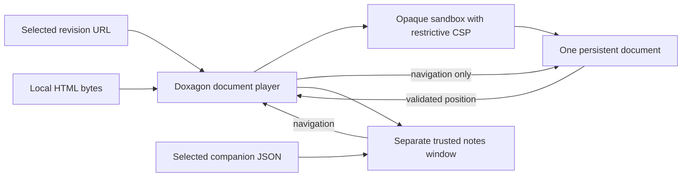

# Local document playback

**A thesis with a selected authored document uses it through the normal Present action.** The player loads one persistent HTML document, not a checkpoint per cue. Standalone files can still be selected through Presentations → Open HTML document; local file selection uploads nothing.



## Select a thesis’s default document

Place the authored HTML and its optional companion notes in the thesis’s `outputs/document/` directory. Select them in `outputs/document/presentation.json`:

```json
{
  "schema": "doxagon.authored-document/1",
  "document": "observatory.html",
  "notes": "notes.json"
}
```

Both the main `/presentations?thesis={thesis}` view and the direct `/present/{thesis}` route check this selection **before opening any checkpoint workspace or session**. When selected, they navigate the sandbox to a SHA-256-pinned HTML response. The server verifies a bounded snapshot before returning those exact bytes; the browser can parse them as they arrive. Local files and older descriptors without `renderUrl` retain browser-side hash verification and the blob boundary. In the main view, **Present** expands that existing frame into the audience display and opens only the speaker notes and controls in a separate window. No second audience rendering is created. The notes window’s **End presentation** returns the main window to its preview without replacing the document.

Speaker notes load separately when the notes window opens, with the same edition/cue validation as local notes. No file picker or alternate presentation route is required. If popups are blocked, the audience view offers **Open speaker notes** so presentation can recover without reloading the document.

If the selection is absent, existing Step presentations keep their current behavior. An invalid selection or missing selected HTML is an error, not a silent fallback to the old renderer. A missing or mismatched companion does not prevent playback; the notes window offers local-file recovery. Filenames must remain inside this rendering directory; HTML is bounded to 32 MB and notes to 2 MB. The read-only API retains attachment downloads and adds an executable, revision-pinned response with a response-level `sandbox allow-scripts` CSP. That policy also applies when someone opens the render URL directly; isolation does not depend solely on an iframe attribute. This path uses the existing thesis API’s access boundary; publishing the standalone HTML does not publish its companion notes.

## Present a standalone local file

1. In `/presentations`, choose **Open HTML document**. The existing presenter also links to this mode. Direct URL: `/presentations/document`.
2. Choose the authored `.html` file with **Open local HTML**. It must be self-contained, at most 32 MB, and implement the port contract below. No manifest conversion is necessary.
3. Scroll inside the document, use its own keyboard controls, or use Doxagon's **Back**, **Next**, and **Cue** selector. Host Arrow/Page keys, Space/Shift-Space, Home and End work when focus is not in an interactive control. The document decides how adjacent travel, distant jumps, cancellation and reduced motion behave.
4. Click Doxagon's **Speaker notes**, then **Choose companion notes** in the separate window. Select the document's matching `notes.json` (at most 2 MB). The current cue and notes follow document movement; notes-window controls navigate the same document.

The HTML's own Notes popup is deliberately blocked in the sandbox; use the Doxagon button. A blocked Doxagon popup gives an allow-popups-and-retry message. Missing notes do not prevent playback. Bad JSON, a different document/edition or a different cue order is visibly rejected and clears the previous notes. Notes render as text, never authored markup.

**Reconnect** replaces only the MessagePort, not the frame or scroll position, and requires the established identity and cue order again. Leaving the player or selecting another HTML closes notes and destroys the document realm. Reloading the page requires selecting the files again. There is no upload, recent-file persistence, public-file URL, or remote audience replica in this mode.

## Compatibility contract

The bridge is intentionally separate from the receipt-pinned Step runtime. For a local file, the host transfers a MessagePort to the opaque boundary with `{type: 'doxagon:connect'}` and the boundary forwards it after load. A URL-served document can announce `{type: 'doxagon:available'}` to its direct parent as soon as its complete cue map and command listener exist. The player accepts that invitation only from the current iframe and establishes the same validated MessagePort before the remaining image bytes arrive. It falls back to connecting on `load` for older documents, without resetting an already-established connection. The document admits connections only from its direct parent and closes any previous port.

| Direction | Message |
|---|---|
| Document → port | `{type: 'ready', documentId, edition, cues: [{id, title, claims?}]}` |
| Document → port | `{type: 'position', documentId, edition, cue, index, total, progress, chapter?}` |
| Host → port | `{type: 'next'}`, `{type: 'previous'}`, `{type: 'go', cue}`, `{type: 'state'}` |

A ready message must contain nonempty bounded identity strings and 1–1,000 unique cues (IDs and titles up to 1,000 characters). A cue may also carry `claims`, the doxa ids that cue rests on: a unique array of at most 32 entries, every one matching `^d-[a-z0-9-]+$`, refused as a whole ready message when it does not. The cap is what keeps an untrusted document from spending one host vault fetch and one rendered chip per entry. Claims are optional, so a document that sends none plays exactly as before. The speaker-notes window shows the current cue's claims as chips into the graph view, reading each label from `GET /api/doxai/{slug}/label`, a read-only endpoint returning the doxa's `short:` frontmatter field and its belief. Every position must match **both** identity strings, the established cue/index pair and total, with finite progress in `[0,1]`. A malformed, out-of-order handshake or inconsistent position disables controls until reconnect. Window messages never supply playback state. Closed channel generations are ignored; the wire contract has no sequence field, and a valid backward move is not mistaken for stale progress.

Companion notes are `{documentId, edition, cues: [{id, notes}]}` in exactly the ready order. Additional companion metadata is ignored, so an existing companion JSON requires no rewriting. Only the explicitly chosen file is read. Notes bodies never pass to the authored frame.

## Plain-HTTP LAN playback

The normal presenter also works over plain HTTP on a LAN address. Browsers do not expose `crypto.subtle` on those origins, although they do on localhost. Local byte identity uses Web Crypto when available and the bundled `@noble/hashes` SHA-256 implementation otherwise. URL playback instead requires the server to verify the requested hash against the same snapshot it sends; a changed revision returns HTTP 409 before any HTML executes. The host distinguishes these verification locations in **File identity**. HTTPS is not a prerequisite for playback, though plain HTTP does not encrypt traffic.

A saved document that fails to open shows an error and **Retry opening**, not instructions to select a local file. Its existing companion notes and cue metadata require no change. Browser regressions cover both saved and local playback without Web Crypto, plus a mismatched hash being rejected and successfully retried.

## Boundary and ownership

| Owner | Responsibility |
|---|---|
| Document | Viewport within the allocated frame, scroll coordinate, continuous animations, cue discovery, input cancellation and reduced motion. |
| Host | Explicit file selection, frame lifecycle, bounded port validation, cue controls and private notes. It never interprets document DOM or seeks in response to position reports. |
| Opaque boundary | Local files use a blob created under the boundary's CSP. Saved URLs use response-level CSP including sandbox, plus the player iframe's `allow-scripts` sandbox. Neither grants same-origin, popups, top navigation or forms. |
| Existing Step system | Immutable revisions, receipts, absolute checkpoint seeks, server sessions, editor and exports; unchanged by document mode. |

The player does not prefix, parse or rewrite the authored bytes. Local blobs inherit the boundary's policy; saved responses carry an enforced CSP. Inline script/style and embedded data/blob visual media are allowed; fetch connections, external visual resources, base URLs and form submissions are denied. A sandbox is not a blanket promise that every possible navigation or network side channel is eliminated. The trusted notes popup is app-owned and has no opener. Only trusted app styles and plain note strings enter it. A sandbox is not a CPU/memory quota: close the tab for a resource-exhausting document.

Implementation producers: [byte transfer and popup lifecycle](../apps/web/frontend/src/lib/components/presentation/DocumentPlayer.svelte), [port validation](../apps/web/frontend/src/lib/presentation/documentBridge.ts), [opaque CSP boundary](../apps/web/frontend/static/document-host.html), [private notes](../apps/web/frontend/src/lib/components/presentation/DocumentNotes.svelte). The existing [Step preview](../apps/web/frontend/src/lib/components/deck/CheckpointPreview.svelte) still sends server actions and seeks registered checkpoints; no document cue enters that cursor contract.

## Progressive single-file authoring

See [the streaming pattern](./streaming-documents.md) for the sample, packaging helper, test method and limitations. Early rendering alone is not early presentation readiness. Put complete lightweight structure, cue metadata and runtime before large image payloads. A document can then announce its bridge early, show a pending-image notice on a distant jump, and keep fixed geometry while payloads arrive. This changes byte order inside one HTML file, not its deployment format.

The server-pinned URL is verified on the server rather than independently hashed in the browser before execution. It is not a substitute for HTTPS. The route compares the current selection to the requested hash and sends the same in-memory snapshot; it does not promise indefinite historical-revision storage.

## Isolated loopback preview

The repository includes its built frontend. Run the production backend against an empty disposable content root, not a private vault or another service's configuration. From the intended committed platform worktree, with `SOURCERER_SCRATCH_DIR` set to a disposable directory:

```bash
preview=$(mktemp -d "${SOURCERER_SCRATCH_DIR:?}/document-preview.XXXXXX")
git archive HEAD | tar -x -C "$preview"
cd "$preview"
UV_CACHE_DIR="$SOURCERER_SCRATCH_DIR/uv-cache" \
  uv run --extra dev python scripts/preview_document_player.py --port 4188
```

Open `http://127.0.0.1:4188/presentations/document`. The process binds only loopback and refuses an occupied port; choose another `--port` rather than stopping another service. If browsing from another machine, use an SSH local-forward to this loopback port and select a local copy of the HTML and notes. Do not serve the authored directory. Stop with Ctrl-C. A worker preview ends when its managed scratch is deleted; rerun this command after proof or landing.

For source development, install/build only in the scratch copy: `cd apps/web/frontend && npm ci --cache "$SOURCERER_SCRATCH_DIR/npm-cache" && npm run check && npm run build`.

## Reproduce focused proof

In the scratch copy's `apps/web/frontend`, after building:

```bash
UV_CACHE_DIR="$SOURCERER_SCRATCH_DIR/uv-cache" \
  npx playwright test --config playwright.document.config.ts \
  --output "$SOURCERER_SCRATCH_DIR/document-test-results"
```

The dedicated config starts the actual built product on an isolated loopback backend. Chromium must be installed (`npx playwright install chromium`). Set `DOXAGON_DOCUMENT_PORT` if 4187 is occupied. Optional `DOXAGON_DOCUMENT_EVIDENCE` records **synthetic-only** screenshots. Fixtures live in `tests/fixtures/documents`; private exemplars, images, notes and screenshots do not belong in the repository. These checks demonstrate the authored-document protocol, not all arbitrary HTML or cross-browser certification.
