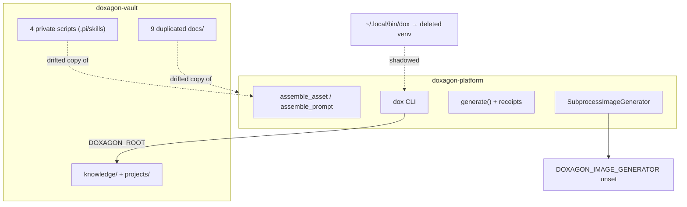
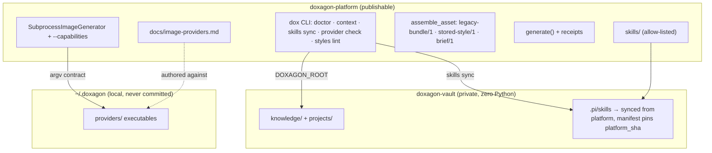
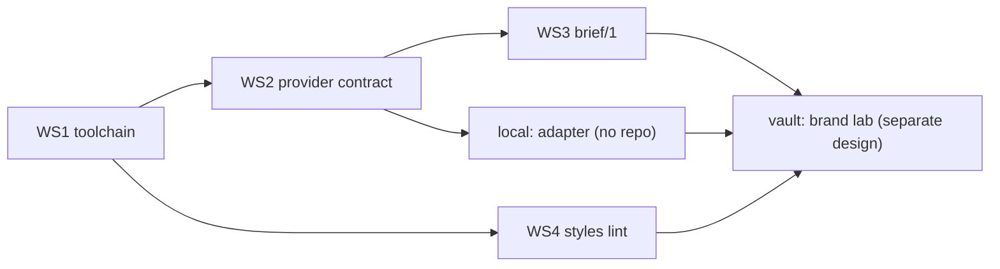

# Modernization: toolchain, provider contract, prompt dialect

**Status:** Design, ready for implementation
**Scope:** Platform repository. The private-vault half (brand system, corpus migration, project diagnostics) is `doxagon-vault/.dev/DESIGN-platform-vault-modernization.md`.

**BLUF.** The platform's generation architecture is sound — assembly is separated from providers, receipts bind prompt hash to output, the store is transactional — but the surface around it rotted: the CLI entry point was dead, skills and docs were copied into the vault and drifted, no provider is configured, references reach providers unlabeled, and the reference ceiling exceeds what at least one provider family accepts. Four workstreams fix this without touching the frozen dialects: (1) a self-diagnosing toolchain with skills owned by the platform, (2) a vendor-neutral provider contract with capability negotiation and a conformance check, (3) a third prompt dialect `brief/1` that labels references and carries intent in a YAML header, (4) a style linter that catches migration hazards before they reach a provider.

---

## 1. Verified findings

Every row was confirmed against source or by execution in the session that produced this document. Line references are to this repository unless prefixed.

| ID | Finding | Evidence |
|---|---|---|
| T1 | `~/.local/bin/dox` was a symlink into a deleted pipx venv (`presentation-factory`); every invocation failed with `bad interpreter` | Fixed during investigation by re-pointing at `.venv/bin/dox`; `dox document context` now reports `platform_sha` |
| T2 | No provisioning path exists from a platform checkout to a working vault toolchain | No `doctor`/`init` command; README does not cover it |
| T3 | The vault carries four Python scripts under `.pi/skills/*/scripts/` duplicating platform logic; one is already broken by an import of a `factory/` tree the vault lacks | `doxagon-vault/.pi/skills/visual-concept-brainstorm/scripts/assemble_context.py:20` |
| T4 | Nine `docs/*.md` files are duplicated verbatim between platform and vault | `comm -12` over both `docs/` listings |
| P1 | `provider_capabilities` reports `configured: false`; generation is blocked | `./src/doxagon/renderings/document_generation.py:34`, observed via `dox document context` |
| P2 | `MAX_REFERENCES = 14` while OpenAI's cookbook documents a maximum of 10 input images for `images.edit`; `generator_argv` forbids dropping references, so a 14-reference closure cannot be served by that family | `./src/doxagon/presentations/generation.py:30`, `:277` |
| P3 | Provider capability is platform-declared, never adapter-declared; the platform cannot learn an adapter's real limits | `./src/doxagon/renderings/document_generation.py:34-42` |
| P4 | No conformance check exists for an adapter short of a paid generation | absent |
| P5 | The provider contract is documented only inside authoring docs, not as a standalone vendor-neutral spec | `./docs/document-authoring.md:69` |
| A1 | Assembled prompts pass references positionally with no role; the vault's own brand record shows unlabeled references get copied as composition | closure inspected in a real `assembled_prompt.md`; `doxagon-vault/library/brand/EVOLUTION.md` "KEY LESSON" |
| A2 | Palette injection fires only when a style name contains the substring `diagram` | `./src/doxagon/renderings/document_generation.py:124-129` |
| A3 | No intent slot exists in any dialect | `assemble_asset` sections list |
| A4 | Both dialects must remain byte-stable; `legacy-bundle/1` exists to preserve legacy output exactly | `./docs/document-authoring.md:78` |
| A5 | Format preference is model-dependent (Claude favors XML, Gemini/Kimi favor JSON; effect sizes small in a second study); no portable "best" format exists | royphilip `llm-format-benchmark` (12 models, raw outputs published); Checksum.ai 90-run experiment |
| M1 | Frontmatter `requires:` is the only dependency mechanism v2 reads; `**Requires:**` body tags are inert. 13 vault bundles use body tags only | `./src/doxagon/renderings/document_generation.py:113`; vault count 36 vs 13 |
| M2 | v2 requires declared `sources:` to be **registered**, not merely present on disk; `refs()` raises `DOCUMENT_INPUT_MISSING` | `./src/doxagon/renderings/document_generation.py:94-103` |
| M3 | No project anywhere has an `authoring.json`; the `create-asset` path is unexercised | corpus scan |
| D1 | `dox document context` reported the vault working tree clean while the platform working tree had deletions; the report covers only the vault | observed |
| T5 | 102 built frontend files under `apps/web/frontend/build/` are tracked. `.gitignore` covers `/build/` and `theses/*/build/` but not this path; hashed bundle names churn on every `npm run build`, and `apps/**` puts minified output on the publication allow-list. Committed because the backend serves the directory directly and a non-Docker install has no Node toolchain | `git ls-files apps/web/frontend/build`; `main.py:112`; `dc1c00d`, `b81d51b` |

Retracted during investigation, listed so they are not re-raised: a `knowledge/`-vs-`library/` path bug (they are symlinks); a requirement for carrier slides (v2 assets are flat keys); inheritance needing a platform change (`plan_adopt_bundle` exists).

---

## 2. Architecture

### 2.1 As found



### 2.2 Target



### 2.3 Principles

| # | Principle | Source of authority |
|---|---|---|
| 1 | The platform owns code, contracts and skills; the vault owns data. Nothing is copied across; the vault is bound by `DOXAGON_ROOT` only | `./src/doxagon/renderings/project.py:67` refuses a platform checkout as a fallback vault; `doxagon-vault/design/public-platform-private-vault.md` |
| 2 | Providers are external executables named by deployment. No vendor access method is committed to any repository | `./src/doxagon/presentation_backends.py:60` docstring; `./publication/platform-files.yaml` gate |
| 3 | A prompt is a review artifact before it is model input; it is read by a human in `generation-plan` before money is spent | `./docs/document-authoring.md:76` |
| 4 | Behavior changes land as a new dialect; existing dialects are frozen | `./docs/document-authoring.md:78` |
| 5 | Fail rather than substitute: no reference dropped, no setting downgraded, no placeholder admitted | `generator_argv` reference check; `resolve_image_generator` returning `None` |
| 6 | The exact bytes hashed in a receipt are the exact bytes the provider received | `resolved_input` sha check at `./src/doxagon/renderings/document_generation.py:210` |

---

## 3. Workstream 1 — toolchain and provisioning

### 3.1 `dox doctor`

Read-only self-report. Extends what `dox document context` already emits under `environment` and `generation`, minus the project dependency.

| Check | Output | Failure mode caught |
|---|---|---|
| Entry point | `platform_command`, resolved target, `platform_sha`, platform working-tree status | T1 (dead shim), D1 (platform dirty state hidden) |
| Vault binding | `DOXAGON_ROOT` value, resolved vault, whether `knowledge/` and `projects/` exist | misconfigured or absent vault |
| Skills freshness | for each `.pi/skills/<name>` in the vault: manifest `platform_sha` vs current; `missing` / `stale` / `current` / `foreign` | T3, T4 |
| Provider | `DOXAGON_IMAGE_GENERATOR` name, resolved path, `executable_sha256`, negotiated capabilities (§4.2) | P1 |
| Legacy shims | any `dox` on `PATH` other than the resolved one | recurrence of T1 |

Exit 0 when every check is `ok`; exit 1 otherwise; `--json` for agents.

### 3.2 `dox skills sync`

The platform ships skills as package data at `src/doxagon/resources/skills/<name>/SKILL.md` (beside the existing `resources/*.yaml`; add `resources/skills/**` to `[tool.setuptools.package-data]`), so they are present in both editable and pipx installs. Skills contain **no Python**; each names a `dox` command and lists `dox doctor` as its first prerequisite.

Install sequence: install the platform → `dox skills sync` in the vault → skills appear in `.pi/skills/` where agents already discover them. Update sequence: `git pull` (or `pipx upgrade`) → `dox skills sync`; until then `dox doctor` reports each skill `stale`. `dox skills sync [--vault PATH]` materializes them into `<vault>/.pi/skills/` and writes `<vault>/.pi/skills/.platform-manifest.json`:

```json
{"schema": "doxagon.skills-manifest/1", "platform_sha": "…", "synced_at": "…", "skills": {"presentation-context": {"sha256": "…"}}}
```

Sync refuses to overwrite a skill whose on-disk hash differs from the manifest (a local edit) unless `--force`; it reports such skills as `foreign`. Vault-authored skills not present in the platform are left untouched and listed.

Why materialize rather than symlink: a symlink encodes the platform checkout path, which does not survive a fresh clone; a manifest survives and makes staleness detectable by `dox doctor`.

### 3.3 `dox context <project>`

Replaces the vault's `load_context.py`. Reports, for either rendering model: identity, argument sources (thesis, diegesis, walk), which model is authoritative, cue/notes agreement, and which skill to invoke. Delegates to existing inspection (`./src/doxagon/renderings/document_context.py`) for document-model projects and to slide inspection for legacy projects. `--json` emits the same structure agents already consume from `dox document context`.

### 3.4 Publication allow-list

Add to `./publication/platform-files.yaml`: `skills/**`, `docs/image-providers.md`, `docs/modernization.md`, and any new `scripts/*.py`. `build_platform_tree.py --check` must pass.

### 3.5 Frontend build is not source

Add `apps/web/frontend/build/` to `.gitignore`; `git rm -r --cached` the tracked files. The Docker path already builds in stage 1 and is unaffected. The non-Docker path gets one of: a documented `npm run build` prerequisite reported by `dox doctor` as `frontend: built|absent`, or the built frontend shipped as package data in tagged releases. Default: the prerequisite; package-data shipping is a follow-on once releases exist.

### 3.6 Installation

README gains one section: install from a checkout with `pipx install -e <checkout>` (update path = `git pull`), or expose `<checkout>/.venv/bin/dox` on `PATH`. `dox doctor` is the verification step and is named by every skill's prerequisites.

---

## 4. Workstream 2 — provider contract v2

### 4.1 `docs/image-providers.md`

Standalone, vendor-neutral, written for an agent authoring an adapter. Contents:

| Section | Content |
|---|---|
| Invocation | exact argv: `<exe> --prompt-file P --output DIR --image-size {1K,2K,4K} --aspect-ratio R [--source F]...`; `--source` count equals the resolved closure exactly, at most the negotiated maximum |
| Inputs | `P` is UTF-8 text; the adapter must send it verbatim (principle 6). Reference files are raw bytes in closure order; roles, when present, are in the prompt text (§5) |
| Outputs | write one or more files into `DIR` with suffix in `{.png,.jpg,.jpeg,.svg,.webp}`; the first in sorted order is taken; nothing else is read |
| Exit codes | 0 success; non-zero failure. A written file plus non-zero exit is retained as `partial_generation` and never admitted automatically |
| Settings | resolution and aspect ratio are mandates, not hints; an adapter that cannot honor them exits non-zero |
| Diagnostics | stderr is read (last 400 bytes) into job failure detail; never print credentials, tokens or signed URLs |
| Capabilities | optional `--capabilities` invocation (§4.2) |
| Environment | `DOXAGON_IMAGE_MODEL` may label the model for receipts; the adapter may read its own configuration from `~/.doxagon/providers/<name>.env` or equivalent; the platform passes nothing else |
| Location | adapters live outside every repository, default `~/.doxagon/providers/`; `DOXAGON_IMAGE_GENERATOR` may be a bare name resolved there before `PATH` |
| Conformance | `dox provider check` procedure (§4.3) |
| Non-goals | dialect translation of the prompt; retry logic; multi-provider fan-out |

The document does not name any vendor. Example adapters, if published, are stubs that write a placeholder and exit 0, marked as such.

### 4.2 Capability negotiation

`--capabilities` is an optional single-flag invocation. A conforming adapter prints JSON to stdout and exits 0:

```json
{"schema": "doxagon.provider-capabilities/1", "max_references": 10, "resolutions": ["1K","2K"], "aspect_ratios": ["1:1","16:9"], "model": "…", "text_rendering": true}
```

`provider_capabilities()` calls it once per process, with a 10-second timeout, and merges: adapter values narrow platform defaults, never widen them. Any failure (non-zero exit, timeout, invalid JSON) falls back to platform defaults and records `capabilities_source: "platform-default"`. Existing adapters that do not recognize the flag exit non-zero and are unaffected.

`generation_plan` refuses a closure larger than the negotiated `max_references` with `DOCUMENT_REFERENCE_LIMIT`, naming the limit and its source. This closes P2 without lowering the platform ceiling for providers that accept 14.

### 4.3 `dox provider check [--executable X] [--live]`

| Mode | What runs | Cost |
|---|---|---|
| default | resolve executable; verify executable bit; compute sha256; run `--capabilities`; validate JSON against schema; report | none |
| `--live` | additionally invoke the full contract once at `1K`, `1:1`, with a synthetic prompt and two 16×16 PNG references in a temp dir; validate an output file appears with a supported suffix; validate exit 0; delete outputs | one provider call |

`--live` prints the provider's cost warning from `paid_effect` before running and requires `--yes`. The check never writes into any project.

### 4.4 Multi-provider readiness (designed, not implemented)

Guaranteed now and preserved by this design: every receipt records `provider` and `executable_sha256`; `prompt_sha256` is verified before every call; variant ids are derived from lineage, index and output hash, not from provider identity. Fan-out later requires only: `DOXAGON_IMAGE_GENERATOR` accepting a list, `generate()` iterating providers per variant, and a plan-level `--provider` override. Nothing in workstreams 1–4 may assume a single provider in new code.

### 4.5 Search path

`resolve_image_generator` gains one step: if the configured name contains no path separator, look in `~/.doxagon/providers/` before `shutil.which`. The resolved absolute path is what is hashed and reported.

---

## 5. Workstream 3 — dialect `brief/1`

### 5.1 Why a third dialect

A4 forbids changing the existing two. A1–A3 are gaps in what they emit. A5 says no fixed format wins across models, so the choice is made on **reading** (principle 3): structured metadata in YAML, descriptive bodies as delimited prose. The vault's prior draft `doxagon-vault/.dev/DESIGN-xml-prompt-structure.md` established that tags are read by the model as natural language and that closing tags reinforce section ends; `brief/1` keeps that for bodies and adds a YAML header only where content is genuinely tabular.

### 5.2 Two layers

| Layer | Artifact | Format | Why |
|---|---|---|---|
| Authoring | `definition.md` | YAML frontmatter + Markdown body (unchanged mechanism; new fields) | already how every bundle is written |
| Emitted | the assembled prompt: provider input, hashed bytes, `generation-plan` review artifact | YAML header block **then** delimited prose sections | YAML where content is tabular (settings, references); delimiters where content is prose, because block scalars are fragile for arbitrary text and tags read as natural language to the model |

### 5.3 Authoring extensions (frontmatter)

Additive; `legacy-bundle/1` and `stored-style/1` ignore them.

```yaml
---
dialect: brief/1               # asset-level; styles inherit the asset's dialect check
intent: "Substack avatar; circle-cropped at 40px; must read as a stamp"
styles: [foundations/linework, master]
sources:
  - file: mark-sketch.png
    role: "composition only; redraw, do not trace"
config: {resolution: 2k, aspect_ratio: "1:1"}
custom_constraints: |
  - ...
---
```

`sources:` items may be a string (role `unspecified`) or `{file, role}`. Style bundles use the same form. `intent` is optional at style level and required at asset level under `brief/1`.

### 5.4 Emitted prompt

```
---
schema: doxagon.image-brief/1
intent: Substack avatar; circle-cropped at 40px; must read as a stamp
settings: {resolution: 2K, aspect_ratio: "1:1"}
references: [{index: 0, file: ink-ref-right.jpg, from: foundations/linework, role: "line quality only; do not copy composition or subject"},
{index: 1, file: mark-sketch.png, from: asset, role: "composition only; redraw, do not trace"}]
---

<rendered_text_rule>…</rendered_text_rule>

<image_constraints>…</image_constraints>

<visual_description>…</visual_description>

<style_definitions>
<style name="foundations/linework">…</style>
<style name="master">…</style>
</style_definitions>
```

Rules:

| Rule | Consequence |
|---|---|
| No implicit injection | `constraints/layout` and palettes are included only when listed in `styles:` (closes A2). Migration guidance: add them explicitly |
| Reference order is closure order | `index` matches `--source` position; roles are attached to the bytes the provider receives |
| Dependency order is `requires:` post-order | unchanged from `legacy-bundle/1` under v2 |
| `**Tag:**` / `**Requires:**` body markers | ignored; `dox styles lint` reports them as stale |
| Text cap | `brief/1` warns (not refuses) above 600 words of prose sections, per A5 evidence that long prompts lose early instructions |
| Hash | `prompt_sha256` covers the entire emitted text including the header; adapters send it verbatim |
| No leading whitespace | No emitted line begins with a space or tab. `references:` is therefore a flow sequence, one mapping per line, rather than a block sequence |

### 5.5 Validation at plan time

`DOCUMENT_DEFINITION_INVALID` if `intent` is missing; `DOCUMENT_INPUT_MISSING` if a role names an unregistered file; `DOCUMENT_STYLE_UNKNOWN` on dialect mismatch, as today. A `sources:` item lacking `role` produces a plan warning, not a refusal.

### 5.5b Why the header starts no line with a space

Found by generating the first real asset (vault `token-smelter-brand`, 2026-09-18). A provider whose adapter drives a web composer rather than an API can have its input **rewritten in transit**: ChatGPT's composer turns a line-leading space into U+00A0, so an indented block sequence arrives altered and the adapter's own verification refuses to send, reporting `first difference at index 370: expected ' ', got '\xa0'`.

No component was wrong. The block sequence was valid YAML; the composer rewrite is vendor behavior; the adapter refusing to send altered bytes is exactly right, because `resolved_input` verifies `prompt.sha256` and §5.6 forbids an adapter repairing the text.

The constraint therefore belongs to the emitter: a flow sequence carries identical structure — verified by parsing both forms to the same mapping — and starts no line with whitespace. One mapping per line keeps a reference reviewable on its own line.

This changes `prompt_sha256` for `brief/1` assets. No generated variant existed when it landed, so no receipt was invalidated.

### 5.6 Dialect translation is out of scope

B5 in the investigation: an adapter re-rendering the brief into a vendor dialect would break principle 6. Not permitted under this design. If ever wanted, the receipt schema gains `rendered_prompt_sha256` beside `prompt_sha256`, and the adapter reports it; that is a separate design.

---

## 6. Workstream 4 — `dox styles lint`

Read-only, runs against a project's `outputs/presentation/styles/` and `assets/styles/`.

| Rule | Severity | Closes |
|---|---|---|
| `**Requires:**` body tag without frontmatter `requires:` | error | M1 |
| `requires:` names a bundle that does not exist | error | — |
| `sources:` names a file absent from `sources/` | error | M2 (disk half) |
| `sources:` file present on disk but unregistered in `authoring.json` (v2 projects only) | error | M2 (registry half) |
| Dependency cycle | error | — |
| Closure > negotiated `max_references` | error | P2 |
| `**Tag:**` body marker | info | A4 hygiene |
| Style has no `dialect` and project has `authoring.json` | warning | — |

`--fix-requires` rewrites body-tag dependencies into frontmatter, preserving the body text, and prints a diff; nothing else is auto-fixed.

---

## 7. Sequencing and dispatch units



Dispatch boundaries follow WHO/WHERE/WHEN. Two platform units, both landing by PR against `main`:

| Unit | Contents | Rationale for the split |
|---|---|---|
| **P1** | WS1 + WS2 + allow-list | Same repo, sequential, but the pair is large enough that context loss in one session is likely; WS2's contract must be final before WS3 consumes it |
| **P2** | WS3 + WS4 | `brief/1` and the linter share the frontmatter model and validations |
| **P3** | WS5 | Generalizes the WS1 sync machinery, so it lands after P1; independent of the dialect work |

The adapter is authored locally against `docs/image-providers.md` after P1 lands; it is never a repository unit.

---

## 8. Acceptance criteria

| ID | Criterion | Proof |
|---|---|---|
| AC-1 | `dox doctor` exits 0 on a correctly provisioned machine and names every failing check otherwise | run before and after breaking `DOXAGON_ROOT`; both outputs captured |
| AC-2 | `dox skills sync` into an empty vault produces `.pi/skills/*` and a manifest; a second run is a no-op; a locally edited skill is reported `foreign` and not overwritten | command transcript |
| AC-3 | `dox context <project>` produces equivalent orientation for one document-model and one legacy project | outputs attached |
| AC-4 | `build_platform_tree.py --check` passes with the new files | command output |
| AC-4b | `git ls-files apps/web/frontend/build` is empty; `npm run build` leaves the working tree clean; `dox doctor` reports `frontend: built` | commands + output |
| AC-5 | `docs/image-providers.md` names no vendor and is sufficient for an agent to write a stub adapter that passes `dox provider check` | stub adapter + check transcript |
| AC-6 | With an adapter declaring `max_references: 10`, `generation-plan` refuses an 11-reference closure naming the adapter as the limit's source; with no `--capabilities`, the platform default 14 applies | two plan outputs |
| AC-7 | `dox provider check --live --yes` against the stub produces a validated output and cleans up | transcript |
| AC-8 | Existing `legacy-bundle/1` and `stored-style/1` outputs are byte-identical before and after P2 | fixture prompts hashed in tests |
| AC-9 | A `brief/1` asset with two roled references emits the documented header and the `--source` order matches `references[].index` | test |
| AC-10 | `brief/1` refuses a missing `intent` and an unregistered roled file with the named codes | tests |
| AC-11 | `dox styles lint --fix-requires` converts the 13 body-tag-only bundles in `rabbit-hole` and the linter then reports zero M1 errors | before/after counts |
| AC-12 | No new code path reads `DOXAGON_IMAGE_GENERATOR` as a scalar in a way that would need rewriting for a list | review checklist item |
| AC-13 | `dox init` into an empty directory produces a root `AGENTS.md` whose first instruction is `dox doctor` and which names `AGENTS.local.md` | init transcript + file |
| AC-14 | `dox skills sync` installs `AGENTS.md`, is a no-op on a second run, reports `foreign` after a local edit, and overwrites only with `--force` | four-step transcript |
| AC-15 | A vault holding only a `doxagon.skills-manifest/1` manifest upgrades without reporting previously-synced skills as `foreign` | before/after status on a fixture vault |
| AC-16 | `AGENTS.local.md` is never created, read, modified, or deleted by any platform code path | `git grep` for the name plus a test asserting an existing local file survives `sync --force` |
| AC-17 | `dox doctor` reports `agents_md` with the same vocabulary as skills | output in each of the four states |

---

## 6b. Workstream 5 — agent resources are platform-owned

### 6b.1 The gap

`dox init` creates `knowledge/`, `projects/`, `media/`, `.doxagon/`, an empty logos and `vault.toml`. It writes **no agent-orientation file**, and `find` confirms the platform ships no `AGENTS.md` anywhere. A freshly initialized vault therefore contains nothing that tells an agent the `dox` CLI exists.

The existing vault's `AGENTS.md` predates the split: it is titled "Presentation Factory", opens with a FROZEN banner that describes the vault as an archive, mentions `dox` **zero** times, and points at `factory/scripts/` and `publish/`, neither of which exists there. An agent that reads it is actively misdirected — the failure mode this workstream closes.

### 6b.2 Two layers

| Layer | Owner | Contents | Sync behavior |
|---|---|---|---|
| `AGENTS.md` | platform, package data | `dox doctor` as step zero; CLI orientation; knowledge-graph rules using canonical `knowledge/` + `projects/`; the two rendering models; a pointer to the local file | installed by `init`, maintained by `sync` |
| `AGENTS.local.md` | vault | brand rules, publishing workflow, project conventions — anything the platform cannot know | never written or read by the platform |

The installed file carries an explicit pointer so orientation always begins at the current platform text and routes onward:

```markdown
## This vault's local conventions

Read ./AGENTS.local.md if present — conventions this vault owns. The platform
never overwrites it.
```

A fresh vault has no local file and the pointer finds nothing, which is correct rather than an error.

Two files rather than one file with a preserved region: merge-preserving a marked span inside a single file is fragile under both hand edits and `--force`, and a failed preserve silently destroys vault-owned content.

### 6b.3 Generalize sync, do not fork it

`sync_skills` (`src/doxagon/toolchain.py:79`) is already content-agnostic apart from `packaged_skills()`: it compares a manifest digest against disk, reports `foreign` on local edit, refuses to overwrite without `--force`, and pins `platform_sha`. An agent resource wants exactly that contract.

Generalize to a resource set of `{name, package source, vault destination}` covering skills (`.pi/skills/<name>/SKILL.md`) and the root `AGENTS.md`. The manifest schema becomes `doxagon.agent-resources-manifest/1` with a `resources` map; a `doxagon.skills-manifest/1` manifest already on disk is read as the skills half so an existing vault is not re-flagged wholesale.

`dox doctor` gains an `agents_md` check: `missing`, `current`, `stale`, or `foreign`, reusing the skill status vocabulary.

### 6b.4 Init writes it

`initialize_empty_vault` (`src/doxagon/workspace.py:722`) writes the packaged `AGENTS.md` at the vault root, so a fresh vault is oriented before any sync runs.

---

## 9. Risks

| Risk | Mitigation |
|---|---|
| Materialized skills diverge from platform between syncs | `dox doctor` reports `stale`; skills name `dox doctor` as their first prerequisite |
| `--capabilities` adds a subprocess call to every context read | cached per process; 10 s timeout; failure is non-fatal |
| `brief/1` warns on long prompts and authors ignore it | warning is surfaced in `generation-plan` output beside the cost warning |
| A provider family cannot render text; the wordmark use case fails silently | `text_rendering` capability; `brief/1` sets `requires_text: true` when a `<rendered_text>` block is present and the plan refuses on mismatch |
| Publication check widened by mistake | new paths are explicit entries, not globs, except `skills/**` |

---

## 10. Open decisions

| # | Decision | Default if unanswered |
|---|---|---|
| 1 | Should `dox context` replace `dox document context` or sit beside it | beside; `document context` remains for the document group's snapshot semantics |
| 2 | Should `brief/1` warn or refuse above the word cap | warn |
| 3 | Adapter default directory name (`~/.doxagon/providers/`) | as written |
| 4 | Whether `dox doctor` should also detect vault-side `CLAUDE.local.md` ambient-state markers | yes, as `info` |
| 5 | Whether the packaged `AGENTS.md` should also be materialized as `CLAUDE.md` for harness compatibility | no; the vault already symlinks `.claude/skills` → `.pi/skills`, and a second copy of the same text is a drift source |
