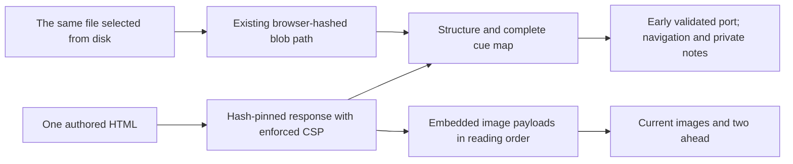

# Streaming single-file presentations

**One self-contained HTML can expose its complete controls and text before its embedded images finish arriving.** Put the lightweight structure and runtime first; put image payloads afterward. This reference is a delivery/authoring pattern, not a converter for legacy slides.



## Contract

| Must deliver | Mechanism |
|---|---|
| One deployable HTML; no external asset, CSS or JS dependency | All bytes remain inside that HTML |
| Same document scrolls standalone and presents in Doxagon | Document owns the scroll coordinate; player sends navigation only |
| Notes stay private | Separate companion JSON read by the trusted notes window; never sent into the frame |
| One authored source | Packing is a one-time preparation step; the resulting HTML becomes the selected source, not a second maintained edition |
| Useful before full transfer | Complete structure, cue map, runtime and early port invitation precede large payloads |
| No layout jumps from arriving pictures | Image geometry exists before bytes; hydration changes `src`, not cue structure |
| Stable notes and navigation | Preserve cue IDs/order and edition; update notes together if cues change |
| Preserve local-file playback and old documents | Existing byte path remains; URL documents without an early invitation connect on `load` |

## Wire and delivery

The descriptor adds `renderUrl: /api/theses/{slug}/authored-document/render/{sha256}`. The client admits only that exact URL for the selected slug and digest. The route reuses the existing confined, size-bounded file reader, hashes the snapshot, then returns **that same snapshot** as `text/html`. A changed selection returns 409 before any document bytes. No historical snapshot store is created.

This deliberately moves saved-document verification from the browser to the server. It does not authenticate a hostile HTTP intermediary; deploy HTTPS where transport integrity matters. Local files and older descriptors keep the browser's complete-file hash verification.

The render response carries `sandbox allow-scripts` and restrictive CSP, even for a direct top-level visit. Scripts cannot read the app origin or private notes; external visual resources and fetch connections remain blocked. This is not a blanket guarantee against every possible browser navigation or side channel. The response is not a general-purpose vault file server.

The document installs its `doxagon:connect` handler and complete cue map, then sends:

```js
if (window.parent !== window) {
    window.parent.postMessage({type: 'doxagon:available'}, '*');
}
```

This window message contains no state or URL. The host checks its source is the current iframe, then offers the existing MessagePort. `ready` and `position` still undergo the bounded bridge validation. Completing the HTTP load must not reconnect, reset the cue, replace the frame, or reopen notes.

Producers: [render route](./../apps/web/backend/routers/authored_documents.py), [URL validation](./../apps/web/frontend/src/lib/presentation/authoredDocument.ts), [player lifecycle](./../apps/web/frontend/src/lib/components/presentation/DocumentPlayer.svelte), [port validator](./../apps/web/frontend/src/lib/presentation/documentBridge.ts).

## Image packaging

The reference layout has all `.chapter` sections and `img[data-dox-asset]` slots before its navigation runtime. Every slot retains its original class, alt text and dimensions. The inlined [asset helper](./../src/doxagon/presentations/resources/document-assets.js) listens for the document's `doxagon:position` event with a chapter id, and attaches the current chapter's images plus the next two image slots as their payloads arrive.

Payloads are ordinary embedded image figures at the end of the same file. A short inline call after each closed figure registers it. Payloads are deduplicated by image-byte SHA-256; existing displayed image nodes are never replaced. Once attached, an image remains attached, so backward movement does not reconstruct or flash it.

With JavaScript disabled, the full narrative remains readable and the payload figures become a labeled image appendix. This preserves access to the pictures, but not their in-place layout in the enhanced presentation. With JavaScript enabled, the appendix is hidden and consumed into the authored slots.

A jump to an image whose payload has not arrived still changes the cue and notes; an explicit pending-image notice replaces any implication that the picture is ready. An absent completion sentinel reports interruption. Reconnection is not a partial-download resume: reload to retry a truncated response.

**This is sequential streaming, not selective network fetching.** Every embedded payload still downloads. The look-ahead window schedules image attachment, not HTTP requests. An end-of-file image cannot arrive ahead of its preceding bytes. Total transfer size and decoded memory still matter; this sample makes no memory-reduction or print/PDF guarantee.

## Prepare an existing single-page document

From the intended platform checkout, with Pillow installed in the chosen interpreter:

```bash
PY=~/development/doxagon-platform/.venv/bin/python
"$PY" scripts/prepare_streaming_document.py /path/to/existing.html /tmp/candidate.html
```

The [packer](./../scripts/prepare_streaming_document.py) accepts a complete document that already emits chapter position events and implements the player bridge. All raster images must already be embedded. It preserves the image bytes and document runtime, moves payloads behind that runtime, and refuses to overwrite an existing output or repack a packed document. It is not an argument generator, a transcoder, or a legacy-slide migration command.

Compare the candidate's cue sequence, image-byte hashes and visual renderings against its source. Only then replace the selected HTML in a branch. Once selected, edit that HTML directly. Do not retain a second authoring copy that can drift.

## Preview a selected document

Supply a document and its matching notes from your own vault. The paths below
are placeholders. Build this platform checkout's frontend first:

```bash
cd apps/web/frontend
npm ci
npm run check
npm run build
cd ../../..

PY=~/development/doxagon-platform/.venv/bin/python
DOC=/absolute/path/to/vault/projects/observatory/outputs/document
"$PY" scripts/preview_streaming_document.py \
  --document "$DOC/observatory.html" --notes "$DOC/notes.json" \
  --port 4197 --kbps 512
```

The [preview](./../scripts/preview_streaming_document.py) copies only those supplied files into a disposable content root, serves the **built application**, and limits document response writes on the server. Default binding is loopback; do not expose a private-vault root. `/present/sample` exercises the actual player; `/sample.html` exercises the same HTML without player UI. No real vault or other service is mounted.

For your document, record server bytes/chunk times at controls-ready, at a
screenshot-confirmed first image, and at full completion. Check notes before
completion, pending-image navigation, fixed geometry, every cue, frame continuity
and CSP isolation. Also check standalone playback at desktop and mobile sizes,
reduced motion, keyboard navigation, local-file playback and the no-JavaScript
appendix. Keep these project-specific checks and their results in your vault.

Use server-side pacing for delivery measurements. `naturalWidth > 0` establishes
image decoding, not first paint; early controls do not imply that every image has
downloaded.

## Regression checks

```bash
PY=~/development/doxagon-platform/.venv/bin/python
PYTHONPATH="$PWD:$PWD/src" "$PY" -m pytest -q
cd apps/web/frontend
npm run check
UV_NO_SYNC=1 UV_PROJECT_ENVIRONMENT=~/development/doxagon-platform/.venv \
  npx playwright test --config playwright.document.config.ts
```

Keep private exemplar HTML, notes and screenshots in the vault or local proof directory, not the platform repository. Backend regressions cover pinned bytes, stale revision rejection, confinement, size limits and a file changing after hashing. Browser regressions cover both input paths, private notes, early invitations, reconnect and malformed URL rejection.
