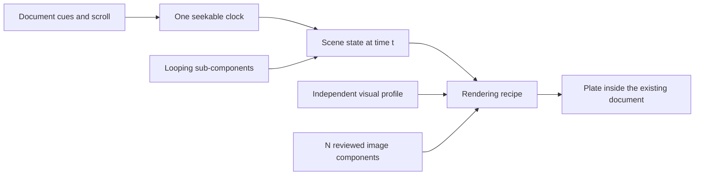

# Presentation motion

**Make the explanation invariant; vary its visual expression.** Doxagon's document owns navigation. A paused GSAP timeline and explicit cue holds drive SVG or Three.js inside that same document. HyperFrames supplies a seek adapter and shaders, not a second player. The animation can use as many custom images as it has moving parts.



## Start here

1. Run `dox doctor`, resolve failures, then `dox context PROJECT`. Continue only on the document model; read the installed [document skill](./../presentation-document/SKILL.md).
2. Inspect `dox document context --project PROJECT --json`. Keep the document's cues, claims and private notes unless a content change was requested.
3. [Choose the medium](#choose-the-medium): flat unless depth carries meaning. Read [the motion contract](./reference/motion-contract.md). Write the assertion each hold must leave visibly true. Pick techniques from [the pattern catalogue](./reference/patterns.md) for that explanation, not for the sample's appearance; two to four patterns is usually enough.
4. Load only the needed recipe and [the style-variation discipline](./reference/style-variation.md). Use the project visual system. The sample profiles are contrastive teaching fixtures, not recommendations.
5. For mathematical claims, start with [the exact model and derived geometry](./reference/mathematical-exposition.md), not generated diagrams. For imagery, list the moving parts and give each an image role. Develop the concept with the [concept skill](./../visual-concept-brainstorm/SKILL.md), describe components with the [definition skill](./../visual-definition/SKILL.md), and follow [image components](./reference/image-components.md) to generate, review and select N of them. Each generation run is a separate, potentially paid action. Never run the fixture provider against a real project.
6. Apply document changes through `dox document plan` / `apply`, image changes through `asset-plan`. Validate the actual selected document and host, not just the sample.

## Choose the medium

**Most explanations should stay flat; 3D is a choice that has to earn its place.** Ask: if this were drawn flat, would the audience lose information? If not, stay flat. A box that turns only for show is decoration, and it costs build time, GPU, crisp labels and accessibility.

| The explanation depends on | Medium | Start from |
|---|---|---|
| Flow, sequence, cause and effect, hierarchy, comparison, labelled parts | Flat SVG and DOM on the GSAP clock | [Living engraving](./reference/living-engraving.md), [patterns](./reference/patterns.md) |
| Equations, plots, coordinates in a plane | Flat, geometry-first | [Mathematical exposition](./reference/mathematical-exposition.md) |
| The look of a pictured subject, mood, a viewpoint moving over imagery | 2.5D image layers | [Cinematic layers](./reference/cinematic-layers.md) |
| An object's form: how parts fit, stack, hide or move in space; perspective; occlusion; truly 3D maths | 3D | [The stage library](./reference/stage.md) |

Flat keeps text sharp and readable to assistive technology, needs no GPU, falls back and prints cleanly, and is the cheapest to build, check and restyle. Mixing is fine: a flat plate can carry one small 3D inset where form matters.

## Recipes

| Recipe | What it teaches | Read when |
|---|---|---|
| [Cinematic layers](./reference/cinematic-layers.md) | Transparent image planes, camera choreography, depth, shader transitions | Image identity and changing viewpoint carry the explanation; ink is one possible material |
| [Living engraving](./reference/living-engraving.md) | Exploded layers, DrawSVG paths, MorphSVG marks, torn-paper reveal, explicit reconstruction at time | Relationships, inside/outside or inspection steps matter; SVG is also the no-WebGL fallback |
| [Miniature 3D](./reference/miniature-3d.md) | Solid geometry, lighting, cast shadows, image decals, perspective, finish | Spatial relationships must remain coherent as the camera moves; build it with the stage library |
| [Mathematical exposition](./reference/mathematical-exposition.md) | Exact model → SVG constructions and synchronized MathML, counterexamples, invariants, parameter exploration | Technical or mathematical meaning depends on geometry and equations being correct |

These are rendering techniques, not mutually exclusive brand styles. Do not turn every request into an inspection module, a cream page, a technical font or this five-step story.

## When 3D earns it: the stage library

Use [the stage library](./reference/stage.md): four layers in any mix, one contract, one preview. Start from the cheapest layer that fits and copy its starter.

| Situation | Start from |
|---|---|
| A few solid parts that move, assemble or change finish | [Stage](./kit/stage/starters/stage-scene.js): parts, a look, a pure `pose(t)` |
| A stage scene with one unusual element | Stage, plus `make(T, ctx)` on that part |
| Your own renderer: point clouds, shader worlds | [Helpers](./kit/stage/starters/helpers-scene.js): your scene, the host, only the helpers you want |
| Entirely new | [Scratch](./kit/stage/starters/scratch-scene.js): raw Three and the contract |
| A part needs printed or painted art | [Skins](./kit/stage/starters/skin-scene.js): a document image as a repeating tile or a continuous wrap |

A look is a name or a few parameters: `'satin'`, `'clay'`, `['xray', { background: '#000' }]`, `{ base: 'cel', outline: { width: 3 } }`, or your own surface function. A skin lays a generated image on a part: `skin: { image: 'slot-id', mode: 'wrap' }`, or `mode: 'tile'` with a world size and an optional tint, so one light-on-black image serves any palette ([skins](./reference/stage.md#skins), [generating them](./reference/image-components.md#skins)). Defaults are a floor, not a look; choose camera, light, surface and lines for each experience. Check every iteration with one command, which renders all holds into one contact sheet and checks determinism, framing, pixel ratio, reduced motion, errors and network:

```bash
python "$SKILL/scripts/preview_scene.py" --scene my-scene.js --output /tmp/scene-preview
```

## Patterns

[The catalogue](./reference/patterns.md) maps fifteen seek-safe patterns to sample source and HyperFrames rule names. The central one is the **looping sub-component**: one authored revolution in its own timeline, driven by an eased cycle counter on the master timeline. It spins up, drives readings and particles, travels from its station, rides the object, and locks at rest. Others include multi-phase camera, depth scatter and reassembly, staggered paths with spring pop, rack focus, path drawing and morphs, torn-paper reveal, particle pools, echo trails, tracking brackets and stepped readouts.

## Open the sample sheet

Resolve paths against **this skill directory**, not the process working directory. In an installed vault:

```bash
SKILL="$DOXAGON_ROOT/.pi/skills/presentation-motion"
python "$SKILL/scripts/build_gallery.py" --output /tmp/motion-samples
# Open /tmp/motion-samples/index.html. One offline sheet, four tabs; no runtime network.
python "$SKILL/scripts/probe_gallery.py" --html /tmp/motion-samples/index.html --output /tmp/motion-samples-proof
```

Python needs Pillow; the probes also need Playwright and its Chromium installation. Use the Python environment that runs `dox`; it supplies those dependencies. Outputs must be new directories. Helpers never change a selected document.

## Check the installed skill

The skill carries its own self-test, so it can be verified wherever it is installed:

```bash
PY="$(dirname "$(readlink -f "$(command -v dox)")")/python"
"$PY" "$SKILL/scripts/selftest.py"              # identities, consistency, hashes, links, builders, tools
"$PY" "$SKILL/scripts/selftest.py" --pipeline   # plus the real dox image pipeline, free fixture provider
"$PY" "$SKILL/scripts/selftest.py" --browser    # plus the browser probes and scene previews
```

The pipeline mode builds a disposable synthetic vault from [the bundled fixture](./samples/pipeline/document.html), registers every component, generates two with the free fixture provider, binds and selects them, and validates the document. It never touches a real project or a paid provider. A failing check names the broken contract.

| Tab | Sample | Focused builder and probe |
|---|---|---|
| Motion recipes | [Inspection](./samples/inspection.json): five holds and six image components across three rendering recipes × the [visual profiles](./samples/profiles.json) | `build_sample.py` / `probe_sample.py`; pass `--case "$SKILL/samples/transfer.json"` for the [transfer case](./samples/transfer.json) |
| 2D eigenvectors | A 2 × 2 map, invariant lines, a direction explorer and a change of basis ([recipe](./reference/mathematical-exposition.md)) | `build_math_sample.py` / `probe_math_sample.py` |
| 3D transformation | A 3 × 3 map that turns space about the cube diagonal and stretches it; the camera flies to look straight down the invariant line; drag or use the slider to turn the view | `build_math_sample.py --lesson space`; checked by `probe_gallery.py` |
| 3D looks | [A machine](./samples/stage/machine.js) on the stage: paper drawing to solid, output, check; every built-in look, looks made by changing parameters, and two [generated skins](./samples/stage/skins/README.md) (a tinted tile and a wrap), each shown with the call that made it | `build_stage_sample.py`; checked by `preview_scene.py` and `probe_gallery.py` |

The motion fixtures are transparent geometric drawings for every component and style. The mathematical samples draw coordinates and equations directly and use zero image components. The sheet contains no presentation, generated project art, claims, private notes or project acceptance evidence. To preview reviewed motion components, pass `--assets DIRECTORY` containing `STYLE/COMPONENT.png` for every profile and component. Supplying files does not generate, admit or select them in Doxagon.

## Adapt and deliver

The stage library ([kit](./kit/stage/kit.js), [host](./kit/stage/host.js), [stage](./kit/stage/stage.js)) is a library: inline it unchanged with the bundle and your scene script. For the other recipes, copy the needed machinery from the kit ([choreography](./kit/choreography.js), [renderers](./kit/renderers.js), [runtime](./kit/motion.js)) into the project's authoring workspace. Keep managed skill files unedited so platform updates remain available. The sample is a worked implementation, not a general scene framework: replace its paths, parts and five-hold choreography when the argument requires something else.

The focused builders produce a standalone page plus an integration shell (`plate-shell.html`, `math-shell.html`) without image bytes or a mount call. See [integration](./reference/motion-contract.md) before inserting it; copying the complete preview into the selected HTML is not the integration procedure.

Deliver: the cue/hold table, chosen patterns, recipe and style rationale, each component's asset identity and provenance, authoritative document plan and application, and [validation evidence](./reference/validation.md). State fallback, performance and art limitations. Check [dependency terms](./vendor/DEPENDENCIES.md) before redistributing; GSAP has its own license.
