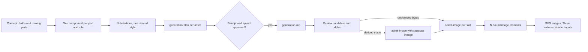

# N generated components, not one flattened scene

**An animated plate can use as many custom images as it has moving parts. Generate each as its own Doxagon asset, inspect its alpha, then select it into a stable slot the animation reads.** Animation code consumes selected images; it never calls a provider or manages provenance.



## Decompose by role

The sample consumes six components per visual style ([component list](./../samples/inspection.json)). Each role carries a compositing contract the animation depends on ([role contracts](./../scripts/asset_requests.py:16)).

| Role | Sample components | How the animation uses it | Contract the image must keep |
|---|---|---|---|
| Layer | `base`, `core`, `cap` | Scattered into depth, tumbled, reassembled; the core is the shader's revision target | Identical framing, view and pivot across layers; only this layer's part is opaque, in its assembled position |
| Actor | `probe` | Instanced three times, staggered, rack-focused | Centered, compact, legible small |
| Loop | `scanner` | Rotated continuously; a decal on the 3D spinner | Seen from above, centered on its axis, rotationally asymmetric, no baked blur |
| Emblem | `seal` | Pops in with a spring and a bloom | Closed shape, generous margin |

The [concept skill](./../../visual-concept-brainstorm/SKILL.md) decides whether time adds meaning and which parts move. The [definition skill](./../../visual-definition/SKILL.md) owns how each component is described and generated. Use as many components as the explanation has independently moving or changing parts, and no more. Unchanging context belongs in one plate or in code-drawn geometry.

Registered layers are the hard case: separately generated layers rarely align by accident. Generate or select the whole object first, embed it, and pass its inspection item as a registration reference for each layer. Then review the overlay before selection. If layers still drift, admit a reviewed derivative instead of forcing them.

## Emit the requests

The helper writes reviewable requests and changes nothing:

```bash
python "$SKILL/scripts/asset_requests.py" --case "$SKILL/samples/inspection.json" \
  --style studio --prefix study --reference-item WHOLE_OBJECT_ITEM \
  --slot base=plate-base --slot core=plate-core --slot cap=plate-cap \
  --slot probe=plate-probe --slot scanner=plate-scanner --slot seal=plate-seal \
  --output /tmp/component-requests
```

It writes one style request, one `create-COMPONENT.json` per component, a bind request (a template when slots are missing) and `sequence.json` with the ordered steps. Its teaching style comes from the sample profiles. In a project, pass `--style-key` with the project's registered style instead of creating another. Definitions state roles and contracts, not colours or fonts. Appearance belongs to the style.

## Run the existing commands

Run `dox doctor` and `dox context PROJECT` first. Use a **fresh snapshot after every applied mutation**.

```bash
dox document context --project PROJECT --json
dox document asset-plan --project PROJECT --snapshot SNAPSHOT \
  --request /tmp/component-requests/create-core.json --output /tmp/core-plan.json
dox document apply --project PROJECT /tmp/core-plan.json
# Repeat for each component, then one plan per asset:
dox document generation-plan --project PROJECT --snapshot FRESH_SNAPSHOT \
  --asset study-core --variants 1 --resolution 1k --aspect-ratio 1:1 --output /tmp/core-generation.json
```

Read each **assembled prompt**, ordered references, provider identity and digest, settings and warnings. N components means N potentially paid provider actions: state the count when asking for approval. A reference or capability failure is not permission to drop a reference or lower the resolution. After approval:

```bash
dox document generation-run --project PROJECT --key study-core-1 /tmp/core-generation.json
dox document generation-job --project PROJECT JOB_ID
```

A job records variants; it does not select them. Keep the idempotency key for a retry of the same action; a new experiment needs a new reviewed plan.

## Verify transparency

There is no platform transparency switch, and a prompt that asks for one proves nothing.

```bash
python "$SKILL/scripts/check_alpha.py" PATH_TO_CANDIDATE --output /tmp/alpha-review
```

The [checker](./../scripts/check_alpha.py:11) confirms fully transparent pixels exist and writes light and dark previews. **It cannot certify segmentation, clean edges, pivot or registration.** Review the previews, and for layers, an overlay of all of them. If matting is needed, keep the generated original and its receipt, and admit the derived bytes as an admitted derivative with their source hash.

## Bind, select and mount

Bind every component slot by the image's `id`:

```json
{"operation":"bind-slots","associations":{"plate-core":"study-core","plate-scanner":"study-scanner"}}
```

Then select a real variant into each slot:

```json
{"operation":"select-image","key":"study-core","variant":"VARIANT_ID","slots":["plate-core"],"quality":92}
```

Mount with `assets: {STYLE: {base: 'plate-base', core: 'plate-core', ...}}` ([mount](./../kit/motion.js:18)). The runtime stays not-ready until every mapped image is resident, and rebuilds textures when any `src` changes. Labels and verdicts stay in DOM text, never baked into a component.

## Skins

**A skin is a component whose role is a surface, not an object.** Use role `skin-tile` or `skin-wrap` in the case file; the request swaps the silhouette contract for a surface contract ([roles](./../scripts/asset_requests.py)). One generation per skin, approved like any other.

| Role | Ask for | `aspect_ratio` |
|---|---|---|
| `skin-tile` | Seamless in both directions, one motif family, no focal point; light marks on pure black (or real alpha) so one image can be keyed and tinted to any palette | `1:1` |
| `skin-wrap` | A panorama with the composition spread across the width, large simple shapes, a calm top edge that may be cropped; no text | The platform ratio closest to and wider than the wrapped span, usually `16:9`; the wrap crops the rest |

Derive the motif from the subject, never from the samples. Review it as a surface: tile it 2 × 2 and look for seams and repeating blotches, and preview it on the part at the size it will be seen. Select it into an image slot and pass that slot's id as `skin.image` ([skins](./stage.md#skins)). The [sample skins](./../samples/stage/skins/README.md) record their prompts and processing.

## Free integration proof

[The fixture provider](./../scripts/fixture_provider.py:1) writes a deterministic 1K transparent geometric image, chosen by prompt hash so N requests yield distinguishable images, and reports `motion-fixture-no-generation`. It proves the plumbing for N components, not prompt compliance or image quality. Use it only in a disposable synthetic vault. Its source is installed as data, so make a disposable executable copy to use it as a provider.
