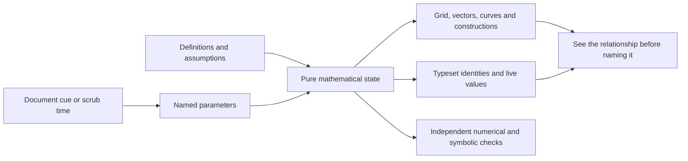

# Mathematical exposition

**Animate the mathematical objects, then let the notation name the relationship the viewer has already seen.** Coordinates, functions and equations are the source of truth; SVG/Three.js is their view. This is the useful part of a 3Blue1Brown-style explanation, not a requirement for dark backgrounds or copied visual branding.



## The executable sample

```bash
SKILL="$DOXAGON_ROOT/.pi/skills/presentation-motion"
python "$SKILL/scripts/build_math_sample.py" --output /tmp/eigenvector-study
python "$SKILL/scripts/probe_math_sample.py" --html /tmp/eigenvector-study/index.html --output /tmp/eigenvector-proof
```

The example uses the fixed matrix **A = [[2, 1], [1, 2]]**, with eigenpairs **v₊ = (1, 1), λ₊ = 3** and **v₋ = (1, −1), λ₋ = 1**. It is an original worked explanation, not a copy of a video. The night-board and paper-diagram treatments share identical mathematics.

| Hold | Seconds | Visible argument |
|---|---:|---|
| Basis | 0 | Any vector is a combination of two basis vectors |
| Columns | 6 | The columns of A are the destination vectors A e₁ and A e₂ |
| Transform | 14 | Grid points, basis vectors and the tip-to-tail construction all obey the same map |
| Find directions | 23 | Compare v and A v on the unchanged reference grid; an angle explorer finds both invariant lines |
| Stretch | 32 | Along (1, 1), A scales length by 3 without changing the line |
| Eigenbasis | 40 | Along (1, −1), A scales by 1; in this basis P⁻¹ A P = diag(3, 1) |

The transition uses **T(s) = (1 − s)I + sA**. While it is in progress, the matrix, vector labels and readouts say T(s), not A. The grid resets before the direction comparison; that reset is labeled. At the final hold the eigenbasis grid replaces the transformed Cartesian grid, without moving the vectors' world coordinates.

The angle explorer is enabled at the direction-finding stage. Changing its parameter pauses travel; navigating to another cue clears the override. Both zero and nonzero residuals are observable, so the exercise includes counterexamples instead of merely asserting alignment.

## The 3D sample: what a 3 × 3 matrix keeps

```bash
python "$SKILL/scripts/build_math_sample.py" --lesson space --output /tmp/space-study
python "$SKILL/scripts/build_gallery.py" --output /tmp/motion-samples   # all samples, one sheet
```

The matrix **A = [[1, 1, 2], [2, 1, 1], [1, 2, 1]]** is a one-third turn about the cube diagonal d = (1, 1, 1) composed with a fourfold stretch along d. The animation follows that screw path exactly: T(s) turns s thirds of a revolution about d and stretches d by 1 + 3s, so **T(1) = A**, **T(s)d = (1 + 3s)d** and **det T(s) = 1 + 3s** at every frame.

| Hold | Seconds | Visible argument |
|---|---:|---|
| Basis | 0 | e₁, e₂, e₃ and the unit cube they span |
| Columns | 8 | The columns of A as destination arrows |
| Twist | 18 | Lattice, cube faces and basis arrows follow T(s); the dotted helix is e₁'s path; volume reaches 4 |
| Down the diagonal | 28 | The camera flies to look along d, then replays the twist: d is a point at the centre, the hexagonal outline turns 120° |
| Invariant line | 40 | A d = 4d; p(λ) = (λ − 4)(λ² + λ + 1), whose quadratic factor has no real roots, so the perpendicular plane turns instead |

The [3D model](./../kit/math/space-model.js) owns the screw path, camera legs and a perspective projection identical to a three.js camera. The [view](./../kit/math/space.js) draws projected SVG: depth-sorted translucent faces, lattice lines, arrows with screen-space heads, and labels at projected tips. Turning the view (slider or drag) is camera-only; cue navigation restores the authored framing. Projected SVG keeps lines and labels exact and needs no WebGL. Use the three.js recipes when lighting, occlusion or many surfaces carry the meaning.

Camera movement is part of the argument, not decoration: the fly-in to the diagonal is chosen because the invariant line becomes a single point and the rotation becomes a planar turn. Pick the viewpoint that makes the claim visible, then move there on a cue.

## Separate proof from presentation

| Layer | Sample source | Responsibility |
|---|---|---|
| Model | [mathematical state](./../kit/math/model.js) | Matrix application, interpolation, eigenpair residual, change-of-basis data; no DOM, clock or pixel coordinates |
| View and clock | [lesson](./../kit/math/lesson.js) | One paused GSAP timeline, SVG projections, native MathML, cue navigation and exploration |
| Styling | [two visual profiles](./../kit/math/lesson.css) | Palette, fonts, contrast, responsive layout; never changes numbers |
| Build | [offline builder](./../scripts/build_math_sample.py) | Inline only required GSAP/font bytes; no GPU bundle or generated image requirement; `--lesson plane` or `space` |
| Proof | [2D probe](./../scripts/probe_math_sample.py), [sample-sheet probe](./../scripts/probe_gallery.py) | SVG endpoints agree with the model in 2D and after 3D projection; seeking, styles, tabs and view controls preserve identities |

Derive grid lines, arrow endpoints, arrowhead orientation, angle arcs, decompositions and readouts from the **same** state. Do not tween each object independently to an approximately correct picture. Easing may control a mathematical parameter, but must not change an asserted identity.

## A reusable visual grammar

| Pattern | Purpose | Constraint |
|---|---|---|
| Coordinate map | Linear transformations, projections, complex-plane maps | Define world-to-screen conversion once; retain mathematical units |
| Dependent construction | Tip-to-tail vector addition, tangent/secant lines, projections | Recompute all dependent objects from the parameter |
| Counterexample → invariant | Eigenvectors, conservation, symmetry | Show ordinary cases before highlighting the special set |
| Object persistence | Before/after ghosts, fixed color roles | Identity remains recognizable during a transformation |
| Geometry ↔ equation | Colored columns, symbols tied to arrows, synchronized values | Typesetting is derived from the exact model, never generated as artwork |
| Change of representation | Cartesian versus eigenvector basis, time versus frequency | Label the new coordinates; a diagonal matrix is not A in the old basis |
| Parameter exploration | Angle, slope, frequency, time step | Exploring pauses the authored sequence; Next returns to the cue contract |

Other good lesson subjects: a secant approaching a tangent, Riemann sums approaching area, convolution as a moving overlap, Fourier components assembling a signal, or a projection explaining least squares. Each needs its own validated model and counterexamples; changing the title of this eigenvector sample is not sufficient.

## Doxagon integration

The builder emits `math-shell.html`, without a mount call or additional presenter. Insert it through a reviewed document text plan. After DOM readiness, call `DoxMathLesson.mount(root)`. Connect the existing document controller to `lesson.go(indexOrSampleCue, animate)` or `lesson.seek(seconds)` just as in the [motion contract](./motion-contract.md). Existing project cue IDs need an explicit mapping to the six sample holds; do not replace the host's cue list or private notes. The standalone controls are for the comparison, not a competing presentation cursor.

`lesson.stateAt(t)` samples the pure model without rendering. `setStyle('night'|'paper')` changes only appearance. Reduced motion snaps to the requested hold; explicit playback is disabled. Hidden/offscreen lessons pause, and `destroy()` releases listeners, observers and the master timeline.

## Images and equations

N custom image components may still illustrate a physical analogy, apparatus or context; follow [image components](./image-components.md). **N can also be zero.** A plotted function, coordinate grid, mathematical label, data series or equation should not be delegated to an image generator. Keep geometry and numeric content exact and editable above any contextual art.

This sample uses native MathML for its small matrices and text/SVG for labels. For more demanding TeX, pre-render equation tokens at build time with a licensed typesetter, inline the required SVG/fonts and retain a textual equivalent. Stable token groups can be highlighted or moved to express a derivation; indiscriminately morphing glyph contours can conceal a false algebraic step. No runtime CDN, `unsafe-eval` or remote typesetting service belongs inside the document sandbox.

## Where Manim fits

[ManimGL's own README](https://github.com/3b1b/manim) describes the engine originally created for 3Blue1Brown's explanatory videos; it also distinguishes the separate Community Edition. Manim is a reasonable offline video-authoring choice when a finished film is the deliverable. This kit does **not** install or emulate Manim: it implements one browser-native lesson with existing GSAP and SVG so Doxagon keeps object-level seeking and interaction. Video integration would need its own playback, readiness and caption contract.

## Mathematical limits

This is a symmetric matrix with two independent real eigenvectors and positive eigenvalues. It does not establish that every matrix is diagonalizable, has real eigenvectors, or preserves direction rather than reversing it. The definition is **A v = λv with v nonzero**. Negative λ reverses orientation; zero λ collapses the image to zero. Generalizing the lesson requires tests for those cases, repeated eigenvalues, singularity and complex eigenpairs where applicable. Numeric tolerances should bound rounding, not turn a near-alignment into a symbolic proof.
