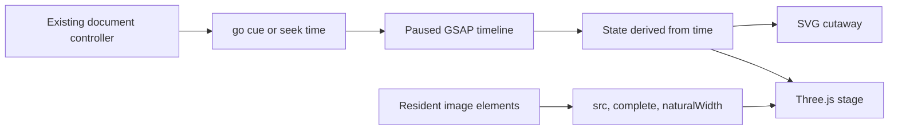

# One clock, one document owner

**Bind motion to the existing document controller; do not introduce a second navigation system.** The kit mounts one plate in a document realm and exposes a small API ([mount](./../kit/motion.js:7)). [Choreography](./../kit/choreography.js) turns time into scene state; renderers only draw that state. It is a worked example, not a multiple-scene runtime.



## Sample contract

| Cue | Seconds | Observable state |
|---|---:|---|
| Define | 0 | Candidate assembled at intake, not approved; scanner idling at its station |
| Move | 8 | Candidate at the review station; scanner begins to spin up |
| Inspect | 18 | Layers scattered, probes in place, all readings in; one criterion requests a change |
| Revise | 29 | Core revised and reassembled, scanner riding the object; still awaiting recheck |
| Release | 40 | Rechecked, sealed and accepted; scanner locked at rest |

The timings and paths are sample choreography, not platform rules. Changing the story requires changing both its cue/hold table and the keyed motion. The three renderers consume the same semantic state. A material change must not make approval happen sooner.

```javascript
const plate = DoxMotion.mount(document.querySelector('#motion-plate'), {
  ...caseConfig,
  profiles: { studio: chosenProfile },
  // One stable image slot per component: base, core, cap, probe, scanner, seal.
  assets: { studio: { base: 'plate-base', core: 'plate-core', cap: 'plate-cap',
                      probe: 'plate-probe', scanner: 'plate-scanner', seal: 'plate-seal' } }
});
plate.go(existingCueId, true); // Animate an adjacent forward step.
plate.go(existingCueId);       // Back, jump and reduced-motion holds.
plate.seek(seconds);           // Scroll or explicit scrub; cancels older tweens.
plate.setRecipe('miniature');  // Same time, different renderer.
plate.setStyle('studio');      // Same time, different material.
plate.state();                 // Runtime fields plus the scene state now.
plate.stateAt(seconds);        // Pure sample for review and tests; draws nothing.
plate.destroy();               // Listeners, observers, timelines and graphics resources.
```

`assets` maps each profile to one existing `` per component. Mount after those elements have been parsed (for example on `DOMContentLoaded`), then seek to the controller's current cue. Omit `assets` only in the synthetic sample, whose image elements carry `data-motion-asset` and `data-style`. Wait for every component's resident image bytes; do not bypass the host's image-residency manager with fetches. Texture invalidation follows any source change. The sample requires five cues; extend the choreography deliberately rather than inventing fake holds for a different story.

## Insert through the document machinery

1. Build into a new authoring directory. Read the emitted `plate-shell.html`; it contains the isolated figure, scoped CSS, inline dependencies and renderer code, but no image bytes or initialization. Use it as source material, not as another page/iframe.
2. Inspect the selected document. Choose one stable image slot per component inside the active chapter. Preserve their embedded/progressive payloads. Production ships one profile; do not ship every comparison variant.
3. Produce bounded text patches with context item IDs to insert the shell and the mount call, and to connect the existing controller. Do not put `data:image/` in text patches: image bytes are selected by `asset-plan`, not by editing base64. If the document has no suitable raster slots, resolve that authoring prerequisite rather than smuggling payloads through scripts.
4. In the controller's navigation method, call `plate.go(cue, adjacentForward && !instant)`. On scroll, call `plate.seek(start + progress * (next - start))`. On leaving the chapter, pause it. The kit does **not** subscribe to a universal Doxagon DOM cue event; such events are document-specific. Add the hook where the actual controller updates its cue, before it reports position to the host.
5. Leave the controller's ready/position message port and cue list authoritative. No extra `doxagon:connect` listener, presenter, popup, nested iframe, polling controller or duplicated notes.
6. Review `dox document plan --project PROJECT --snapshot SNAPSHOT --change change.json --output plan.json`, then apply and validate. Snapshot again after mutations. The plan must preserve claims, cue IDs/order and notes unless those were explicitly in scope.

## Runtime boundaries

- Inline libraries, CSS, fonts and selected image bytes. The document sandbox permits inline code, not `unsafe-eval`, arbitrary requests or embedded frames. Never loosen the host CSP to make a sample work.
- A seek reconstructs time; it does not integrate elapsed frames. Backward, repeated, random and external HyperFrames seeks must agree.
- Cue input supersedes previous animation. Reduced motion lands on holds. Explicit sample playback is never presentation autoplay.
- Offscreen/hidden pages pause. WebGL failure or context loss switches to SVG with an explicit notice. Missing assets remain not-ready, rather than rendering a substitute and claiming success.
- The kit uses the upstream HyperFrames seek adapter and `hf-seek` event. This is not certification against a complete HyperFrames player, capture pipeline or export format.
