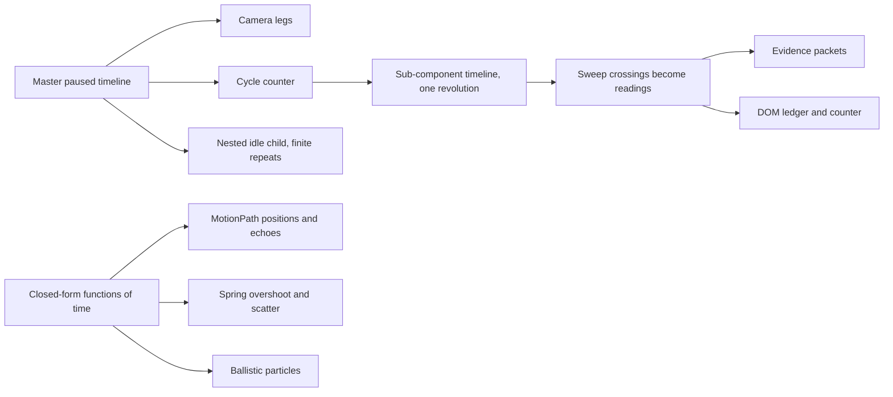

# Pattern catalogue

**Every pattern below is a pure function of timeline time, so cue jumps, scroll scrubbing and reverse seeks land on the same frame.** The sample composes all of them into one 40-second scene; a real plate should usually use two to four. Names in the HyperFrames column refer to that project's pinned animation rules; the kit implements the idea, not their code.

## The looping sub-component

**Author the sub-component's own choreography once, as one revolution, then let the master timeline decide how many revolutions have elapsed.** The scanner's rotation, pulse ring and blink live in a paused child timeline ([revolution](./../kit/choreography.js:88)). The master tweens a cycle counter through idle, spin-up, cruise, recheck and lock ([cycle counter](./../kit/choreography.js:70)). Each frame sets the child's progress to the counter's fractional part.

| Requirement | How the sample meets it | Why |
|---|---|---|
| Seekable loop | `loop.progress(cycles % 1)` from the master's value | `repeat: -1` has no finite duration and cannot be sought deterministically |
| Changing speed | Eased counter legs with matched end speeds (`power2.in` into cruise, `power3.out` out of recheck) | Tweening a child's `timeScale` makes position depend on history |
| Lock at rest | The last leg ends on an integer revolution and the period starts and ends in the same pose | The loop stops in a designed pose, not wherever playback paused |
| Becomes part of the scene | The sweep's crossings are readings ([crossings](./../kit/choreography.js:99)), the part travels from its station, then rides the object's top layer ([handoff](./../kit/choreography.js:152)) | The loop carries meaning: it drives readouts, particles and the final object |
| Attachment | After docking, its position is recomputed from the parent layer every frame | A separately tweened follower drifts away under scrubbing |

A second, simpler loop form is a nested child with **finite** repeats ([idle breathing](./../kit/choreography.js:82)); GSAP resolves repeats from parent time. A third reads a sine directly from time with a per-actor phase offset ([probe hover](./../kit/choreography.js:131)). Use the cycle-counter form when the loop's speed or count matters to the story.

## Catalogue

| Pattern | HyperFrames rule | Sample source | Recipes | Seek rule |
|---|---|---|---|---|
| Multi-phase camera with micro-drift | `multi-phase-camera`, `3d-camera-flight` | [camera legs](./../kit/choreography.js:62) | All three; SVG uses one world transform ([viewport](./../kit/renderers.js:151)) | Explicit from-states per leg ([legs helper](./../kit/choreography.js:34)); drift is a sine of time |
| Looping sub-component and handoff | `sine-wave-loop`, `svg-icon-enrichment` | above | SVG rotate about the part's own centre ([SVG](./../kit/renderers.js:192)); Three spinner group ([Three](./../kit/renderers.js:482)) | Progress from cycle counter; attachment recomputed |
| Control-target sync | `control-target-sync`, `chart-scrub-readout` | [readings](./../kit/choreography.js:166) | Shared DOM ledger ([readouts](./../kit/renderers.js:37)) | Thresholds on the counter; text writes only on change |
| Depth scatter and reassembly | `depth-scatter-assemble` | [layer offsets](./../kit/choreography.js:118) | Registered image planes, solids, SVG layers | Index-derived offsets times an analytic spring track |
| Spring overshoot and pop | `spring-pop-entrance` | [damped spring](./../kit/choreography.js:23), [probe pop](./../kit/choreography.js:133) | All | Closed-form spring of elapsed time, no integrator |
| Staggered multi-actor paths | `multi-cursor-choreography`, `waterfall-entry` | [probes](./../kit/choreography.js:124) | All; paths draw in as actors arrive | MotionPath position at eased progress; stagger cap one beat |
| Evidence particles and burst | `particle-burst` | [packets](./../kit/choreography.js:175), [burst](./../kit/choreography.js:186) | SVG circles, Three points | Fixed pools; quadratic or ballistic closed forms |
| Echo trail | `motion-blur-streak` (echo form) | [echoes](./../kit/choreography.js:198) | SVG ghosts, cinematic sprites, miniature trail line | Positions at earlier times, alpha from speed |
| Rack focus | `depth-of-field-blur` | [focus leg](./../kit/choreography.js:78) | SVG filter ([blur](./../kit/renderers.js:162)), sprite texel blur ([shader](./../kit/renderers.js:289)), fog and dimming in miniature | One focus value drives every layer |
| Path drawing and morph | `svg-path-draw` | [draw and morph timeline](./../kit/renderers.js:132) | Living engraving; Three draws routes with draw ranges | Canonical path strings at holds ([morph endpoints](./../kit/renderers.js:157)) |
| Torn-paper reveal | registry `paper-collage-reveal` | [seeded scraps](./../kit/renderers.js:82) | Living engraving | Seeded edges; flight is `p * p` of time |
| Shader transitions on generated textures | shader registry `ripple-waves`, `cross-warp-morph` | [ground](./../kit/renderers.js:327), [revision](./../kit/renderers.js:352) | Cinematic ground; revised core in both 3D recipes | `u_progress` from state |
| Tracking bracket | `ai-tracking-box` | [corners](./../kit/renderers.js:60) | All; bounds projected by each renderer ([projection](./../kit/renderers.js:508)) | Recomputed from the target every frame |
| Dynamic-scale counter, anchored expansion | `counting-dynamic-scale`, `anchored-layout-expand` | [counter and sheet](./../kit/renderers.js:51) | Shared DOM ledger | Transform-only; no width or height tweens |
| Ambient glow bloom | `ambient-glow-bloom` | seal bloom in the state | All | Peak opacity below 0.45, breathes with the nested idle loop |

## Geometry-first mathematical patterns

Use [mathematical exposition](./mathematical-exposition.md) when accuracy depends on coordinates, formulas or a proof. Its separate executable sample adds a coordinate-map morph, tip-to-tail construction, parameter-driven dependent objects, ordinary-case versus invariant comparison, and a change of basis synchronized with typeset equations. These patterns use a pure mathematical model, not image-generation prompts or independently tweened approximations. The 3D sample adds a perspective-projected coordinate map, a screw-path interpolation that preserves an identity at every frame, a camera move to the viewpoint where the invariant becomes a point, and a view-only orbit control.

## Choosing a subset

Start from the claim at each hold. If a pattern does not make a state change easier to see, leave it out. Sequence, causality and evidence flow usually warrant a loop, readings and particles. Inspection and change usually warrant scatter, rack focus and a morph. Spatial argument warrants the camera. Ornament earns only one ambient pattern.

The validation probe asserts these contracts directly on sampled state ([contracts](./../scripts/probe_sample.py:16)): periodicity, spin-up, attachment, lock, the reading at a sweep crossing, nested repeats, bounded particle pools, revision without approval, stagger and reassembly.
