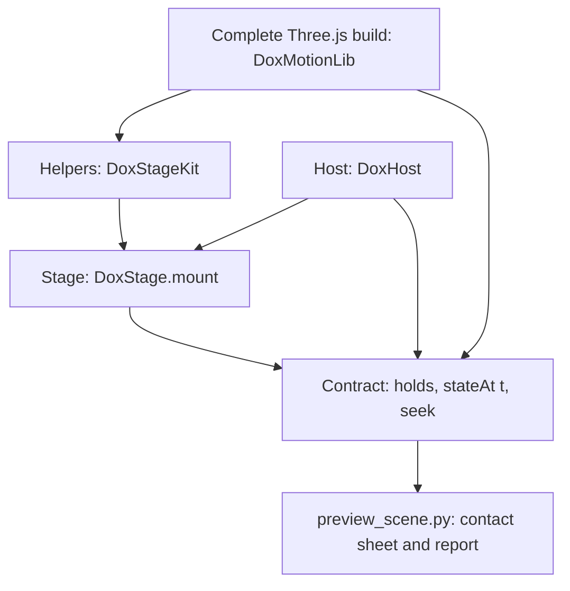

# Stage library

**Four layers, used in any mix, behind one contract and one preview.** Reach for 3D only when the explanation depends on form in space; most plates are better flat ([choose the medium](./../SKILL.md#choose-the-medium)). Take the stage when a scene is a handful of solid parts; take single helpers inside a scene you write yourself; or write everything from scratch. Only [the contract](#the-contract) is required, and [the preview](#preview-and-check) checks it the same way however the scene was built.



| Layer | File | What it gives you |
|---|---|---|
| Complete Three.js | [bundle](./../vendor/motion-deps.min.js) | The whole namespace plus the room environment, rounded box and wide-line add-ons. No workaround for a missing export is ever needed |
| Helpers | [kit.js](./../kit/stage/kit.js) | Plain functions that return ordinary Three objects you own: surfaces, shapes, lines, light, reflections, shadow, camera fit |
| Host | [host.js](./../kit/stage/host.js) | Time, holds, travel, resizing, pixel-ratio cap, visibility, reduced motion and cleanup around any draw function — Three, Canvas 2D or SVG |
| Stage | [stage.js](./../kit/stage/stage.js) | A scene from parts, a look and a pure pose, built only from public helper and host calls |

## Choose the cheapest layer that fits

| Situation | Start from |
|---|---|
| A few solid parts that move, assemble or change finish | [Stage starter](./../kit/stage/starters/stage-scene.js) |
| A stage scene with one unusual element | Stage, plus `make(T, ctx)` on that part |
| A part needs printed or painted art | [Skins starter](./../kit/stage/starters/skin-scene.js): `skin` on the part, or `skins` in the look |
| A custom renderer: point clouds, shader worlds, instanced fields | [Helpers starter](./../kit/stage/starters/helpers-scene.js): your scene, the host, and only the helpers you want |
| Entirely new | [Scratch starter](./../kit/stage/starters/scratch-scene.js): raw Three and the contract |

To leave the stage, copy [stage.js](./../kit/stage/stage.js) into the plate and edit it; it uses nothing private.

## The contract

A scene is an element marked `data-dox-scene` whose `doxScene` property has:

| Member | Required | Meaning |
|---|---|---|
| `holds` | yes | Ascending times in seconds, one per cue |
| `stateAt(t)` | yes | A pure function of time; the same `t` gives the same state after any history |
| `seek(t)` | yes | Show the state at `t`, at once |
| `go(i)`, `play()`, `pause()`, `time`, `pinIdle(s)` | no | Cue travel, playback, current time, and freezing ambient motion for exact captures |

`DoxHost.attach` and `DoxStage.mount` provide all of it; a from-scratch scene calls `DoxHost.expose(root, api, name)`. Ambient motion — a sway, an intake belt — may only depend on the host's free-running `idle` clock, which reduced motion and `pinIdle` freeze. The document's own cue handler calls `go(i)`; never autoplay a presentation.

## Looks

A look is five independent choices — surface, lines, edges, light, background — stored as data. Pass a name, `[name, overrides]`, or `{ base: name, ...overrides }`. Overrides merge one level deep, so `lines: { color }` keeps the line width.

| Look | Surface | Lines | Edges | Light | Good for |
|---|---|---|---|---|---|
| `ink` | Flat colour with self-glow | Ink creases, curved silhouettes | Sharp | Flat | The drawing state; diagrams that should stay diagrams |
| `satin` | Painted metal, clearcoat, powder grain | None | Rounded | Studio, reflections, shadow | Finished objects; the default |
| `clay` | One matte colour; accents keep a tint | None | Rounded | Soft, shadow | Structure before detail |
| `gloss` | Lacquer | None | Rounded | Studio, reflections | Dark or saturated parts that should read as precious |
| `metal` | Brushed metal; accents stay gloss | None | Rounded | Studio, strong reflections | Hardware, enclosures |
| `cel` | Three flat tones | Silhouette outline | Rounded | Ambient and key | Illustration, small sizes |
| `technical` | Gooch warm–cool | Creases, silhouettes | Sharp | None | Technical illustration without dark shadows |
| `engraving` | Hatching on paper | Creases, silhouettes | Sharp | None | Pairs with the living-engraving recipe |
| `xray` | Fresnel density; glow on dark, ink on light | Edges | Sharp | None | Insides and structure |

Override keys: `surface`, `accentSurface`, `edges`, `light`, `lightIntensity`, `environment`, `shadow`, `toneMapping` (`none`, `neutral`, `aces`, `agx`), `exposure`, `background`, `palette` (per role), `skins` (per role or part id, see [skins](#skins)), `monochrome` (`{ color, mix }`), `lines` (`{ color, width, opacity, angle }`), `outline` (`{ color, width, opacity, curvedOnly }`). Colours may be palette tokens such as `'paper'` and `'ink'`.

```js
look: ['xray', { surface: ['xray', { color: '#ffffff' }], lines: { color: '#ffffff' }, background: '#000000' }]   // black and white
look: ['gloss', { palette: { housing: '#2b4a70' } }]                                                         // one part's colour
look: { base: 'satin', lines: { width: 1, opacity: 0.4 } }                                                    // satin with ink
```

## Surfaces

`K.surface(kind, options)` returns a material. Unknown options are refused with the list of valid ones; `three: {...}` sets raw material properties.

| Kind | Options and defaults |
|---|---|
| `flat` | `color`, `glow` 0.62, `roughness` 0.82 |
| `satin` | `color`, `roughness` 0.48, `clearcoat` 0.35, `clearcoatRoughness` 0.3, `grain` `'powder'`, `bump` 0.2 |
| `clay` | `color`, `roughness` 1 |
| `gloss` | `color`, `roughness` 0.16, `clearcoat` 1, `clearcoatRoughness` 0.04 |
| `metal` | `color`, `roughness` 0.3, `brushed` true, `anisotropy` 0.5 |
| `cel` | `color`, `steps` 3 |
| `warmcool` | `color`, `cool`, `warm`, `coolMix` 0.25, `warmMix` 0.6, `highlight` 0.55 |
| `hatch` | `color`, `paper`, `ink`, `spacing` 5 (CSS px), `tint` 0.22 |
| `xray` | `color` (rim or ink), `background`, `fill` 0.02, `falloff` 2, `strength` 0.55 |

A new surface is a function: `DoxStageKit.defineSurface('glass', (T, options, K) => new T.MeshPhysicalMaterial({ ... }))`, then `look: { base: 'satin', surface: 'glass' }`. A look or part may also give the function directly as its `surface`.

## Skins

**A skin lays a document image on a part: a repeating tile or one continuous wrap.** The image is an ordinary `` in the document, normally a selected image slot; name it by id. Skins apply to lit looks (`ink`, `satin`, `clay`, `gloss`, `metal`, `cel`), which put the image under their own finish: lacquer, satin or metal. Drawn looks keep their own surface.

```js
{ id: 'hull', shape: 'box', size: [1.2, 0.72, 0.62], skin: { image: 'hull-art', mode: 'wrap' } }
{ id: 'drum', shape: 'cylinder', size: [0.34, 0.34, 0.9, 64],
  skin: { image: 'engraving', mode: 'tile', size: 0.35, tint: { base: '#1d3766', ink: '#dfe7f6', strength: 0.8 } } }
look: ['gloss', { skins: { housing: { image: 'hull-art', mode: 'wrap' } } }]   // by role, swappable with setLook
```

| Mode | Behaviour | Image wanted |
|---|---|---|
| `tile` | Repeats every `size` world units, the same on every box face; turned shapes scale along and around | Seamless both ways, one motif family, no focal point. With `tint`, light marks on black (`key: 'luminance'`) or real alpha (`key: 'alpha'`, the default) become `ink` over `base` |
| `wrap` | One image fitted to the wrapped span and cropped, never stretched. Box: front then right side, mirrored over the back and left so the join sits behind; top and bottom take `cap` (default `'sample'`, the image colour at the crop line). Turned shapes: once around, joined at the back | Width over height near the span: `(width + depth) / height` for a box, `π × diameter / height` for a cylinder. Composition spread across the width, calm top edge |

Size features for the screen, not the model: a tiled line closer than about three screen pixels to the next turns to mottle, so enlarge `size` until marks read as marks. The scene reports ready only after its skins are drawn. [Two sample skins](./../samples/stage/skins/README.md) show both modes; generate your own through the document's image assets ([skins](./image-components.md#skins)).

## Stage scene

```js
DoxStage.mount(root, {
  parts: [{ id: 'body', shape: 'box', size: [1.4, 0.7, 0.9], role: 'body' }],
  palette: { body: '#ebe7dc' },
  look: 'satin',
  holds: [0, 2], cues: ['closed', 'open'],
  pose: (t, idle) => ({ body: { rotate: [0, t * 0.3, 0] }, solid: 1 }),
});
```

| Spec | Meaning |
|---|---|
| `parts` | `id`; `shape` (`box`, `cylinder`, `sphere`, `cone`, `torus`, `capsule`, `plane`, `disc`) and `size`, or `make(T, ctx)` returning any Object3D; `role` or `color`; `accent`; `at`, `rotate`, `scale`; `parent`; per-part `surface`, `skin`, `lines`, `outline`, `edges`, `radius`, `shadow` |
| `pose(t, idle)` | Returns `{ partId or model: { at, rotate, scale, visible, opacity }, solid, lines, camera: { azimuth, elevation, zoom, target } }`. Absolute: every frame starts from the rest layout |
| `drawing` | Adds paper-drawing ink that fades as `solid` rises from 0 to 1 |
| `ambient` | Calls `pose` with a running `idle` clock between holds |
| `camera` | `kind` (`perspective`, `orthographic`), `fov`, `elevation`, `azimuth`, `margin` |
| Other | `holds`, `cues`, `look`, `palette`, `fallback`, `maxPixelRatio` (1.5), `transparent`, `travel`, `onFrame(state, three)`, `name` |

The stage frames the union of every pose its timeline reaches, measured part by part, so the object stays in view at every hold. It returns the contract plus `setLook(look)`, `look`, `three` (`scene`, `camera`, `renderer`, `model`, `parts`) and `destroy()`. Errors name the problem: an unknown shape, surface option, parent or posed part.

## Helpers

`const K = DoxStageKit(DoxMotionLib)`

| Helper | Returns |
|---|---|
| `K.shape(kind, size, { rounded, radius })` | Cached geometry; rounded boxes and filleted turned shapes keep their stated size |
| `K.surface(kind, options)`, `K.setSolid(material, s, paper)` | A material; blend a lit material between a paper drawing (0) and itself (1) |
| `K.creases(geometry, style)`, `K.outline(geometry, style)`, `K.line(points, { dash, gap, ...style })` | Wide ink lines on edges, a constant-width silhouette, a polyline. Rounded shapes have no creases; use `outline` |
| `K.light(scene, rig, options)`, `K.environment(renderer, scene, intensity)`, `K.ground(scene, { y, opacity })` | `studio`, `soft`, `flat`, `cel` or `none`; room reflections; a floor that only shows shadows |
| `K.fit(camera, boxOrPoints, { elevation, azimuth, margin, aspect })` | Places a perspective or orthographic camera so every point is in frame |
| `K.sync(scene, { width, height, pixelRatio })` | Line resolution, outline width and hatch spacing for the current frame |
| `K.skinTexture(img, { tint })`, `K.mapTile(geometry, kind, size)`, `K.mapWrap(geometry, kind, aspect)`, `K.sampleRow(texture, v)` | A texture from a document image, keyed and tinted on request; world-size tiling; a continuous wrap returning the share of image height used; a flat colour from one image row |
| `K.grain(kind)`, `K.ramp(steps)`, `K.toneMapping(name)`, `K.dispose()` | Data textures, cel ramps, constants; release everything the kit made |

## Host

`DoxHost.attach(root, { holds, cues, stateAt, draw(state, frame), ambient, maxPixelRatio, travel })` calls `draw` with `{ t, idle, width, height, pixelRatio, reduced }` only when something changed and the root is visible. It returns the contract plus `invalidate()` and `own(disposable)`; `destroy()` releases observers, listeners and owned resources.

## Preview and check

```bash
python "$SKILL/scripts/preview_scene.py" --scene my-scene.js --output /tmp/scene-preview   # a scene script on [data-stage]
python "$SKILL/scripts/preview_scene.py" plate.html --output /tmp/plate-preview             # any page with scenes
```

It runs inside the document's sandbox and CSP at desktop and mobile widths and writes **one contact sheet** of every hold plus a report. Checks: each hold repeats after other seeks (state and pixels), stays framed, is not blank; the canvas respects the pixel-ratio cap; reduced motion arrives at once and holds still; no script errors, network requests or horizontal overflow. Frame times are reported, not judged; headless numbers come from software rendering.

## Keep each scene its own

Defaults are a floor, not a look. Choose the camera, light, surface and line treatment for each experience; vary looks with overrides or your own surface rather than reusing the sample machine's appearance. [Style variation](./style-variation.md) applies: hold the explanation steady, vary its expression.

## Limits

- Hatching is fixed to the screen; during long camera moves anchor it to the surface instead.
- Shadows need a shadow-casting rig (`studio`, `soft`); drawn looks use none.
- Box wraps cover the front and right side, so the camera should favour that quarter; spheres, cones and tori take the simple scaling of their own UVs.
- Framing samples the timeline; a pose that jumps between samples can still clip, and the preview will show it.
- Embed it like any plate: inline the bundle, the three stage files and the scene script, and integrate through [the motion contract](./motion-contract.md).
